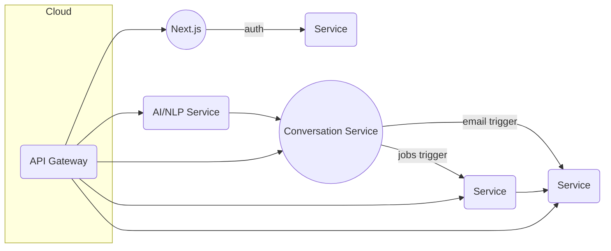

# MVP Production Rollout Plan

## Goals

- Finish the remaining integration and testing work in Phase 1 so the end-to-end flow documented in [docs/DEVELOPMENT_PLAN.md](docs/DEVELOPMENT_PLAN.md) is reliable.
- Wire up a cloud deployment pipeline (per [docs/DEPLOYMENT.md](docs/DEPLOYMENT.md) and the `env.example`) so all services can be released together with the proper environment configuration.
- Provide any lightweight operational guardrails (health checks, secrets, alerts) needed for a safe MVP release.

## Tasks

1. **integration-gateway** – Harden `Conversation Service` + cross-service flows and add the missing API gateway step: implement/request-from [`docs/DEVELOPMENT_PLAN.md`](docs/DEVELOPMENT_PLAN.md) (Step 1.8) the gateway/JWT auth setup and resolve JSON parsing issues from `Profile Analyst Agent`, then document the flow.
2. **tests-e2e** – Expand automated coverage for the MVP (unit/integration + E2E) by filling the gaps noted in [`docs/PROJECT_STATUS_ANALYSIS.md`](docs/PROJECT_STATUS_ANALYSIS.md) (lack of E2E tests and remaining manual cases) using existing test suites and crafting a smoke test that exercises register → dialogue → job matching → email flow.
3. **cloud-deploy** – Create/verify cloud deployment artifacts (Docker Compose or container images, cloud-ready env vars from `env.example`, and GitHub Actions or similar pipeline) mobile to the chosen cloud provider; ensure documentation in [`docs/DEPLOYMENT.md`](docs/DEPLOYMENT.md) reflects the steps and secrets.
4. **operational-readiness** – Add or verify health/readiness endpoints, ensure secrets are validated at startup, and capture any required monitoring/alerting instructions so the MVP can be observed once live.

## Следующие шаги (следующая итерация)

1. **Integration gateway**

   - Подтвердить текущий поток `Conversation Service` и `integrationService` (см. `services/conversation/src/integrationService.ts` и `services/conversation/src/dialogueEngine`) и зафиксировать входные/выходные точки для Job Matching и Email.  
   - Добавить шлюз/гейтвей конфигурацию с JWT-авторизацией (например, `gateway/nginx.conf` или конфиг `Kong`) и задокументировать его в `docs/DEPLOYMENT.md`.
   - При необходимости уточнить `Profile Analyst Agent` JSON-парсер (`services/ai-nlp/src/agents/profileController.ts`) и добавить логирование ошибок парсинга.

2. **Расширение тестирования**

   - Доработать unit/integration-тесты в сервисах User Profile, Job Matching, Email и Conversation (`services/*/tests`) так, чтобы минимальные сценарии регистрации и диалога покрывались автоматически.  
   - Создать E2E-скрипт или Cypress/Playwright сценарий, который проходит регистрацию → запускает диалог → получает вакансии → отправляет email.  
   - Добавить smoke-test на уровне GitHub Actions, запускающий базовый flow перед деплоем (см. `.github/workflows/ci.yml` или аналогичный файл).

3. **Облачный деплой**

   - Проверить/обновить `Dockerfile` и `docker-compose.yml` для каждого сервиса (`services/*/Dockerfile`), убедиться, что все env vars из `env.example` задокументированы и доступны.  
   - Написать или обновить workflow (`.github/workflows/deploy.yml`) для сборки образов, пуша в реестр и деплоя в выбранный облачный хостинг (например, Fly.io или Render).  
   - Обновить `docs/DEPLOYMENT.md`, добавив шаги авторизации к реестру, описания секретов и rollback-процесс.

4. **Операционная готовность**

   - Убедиться, что каждый сервис публикует health/readiness endpoints (например, `GET /health` в `services/*/src/health.ts`) и что они проверяются в деплой-пайплайне.  
   - Добавить валидацию обязательных переменных окружения при старте (например, через `config/schema.ts`) и логировать отсутствующие значения.  
   - Задокументировать базовое наблюдение: какие лог-файлы/метрики проверяются, как дёргать alerts и куда смотреть при ошибках (можно добавить раздел в `docs/DEPLOYMENT.md` или `docs/PROJECT_STATUS_ANALYSIS.md`).

## Architecture Sketch

