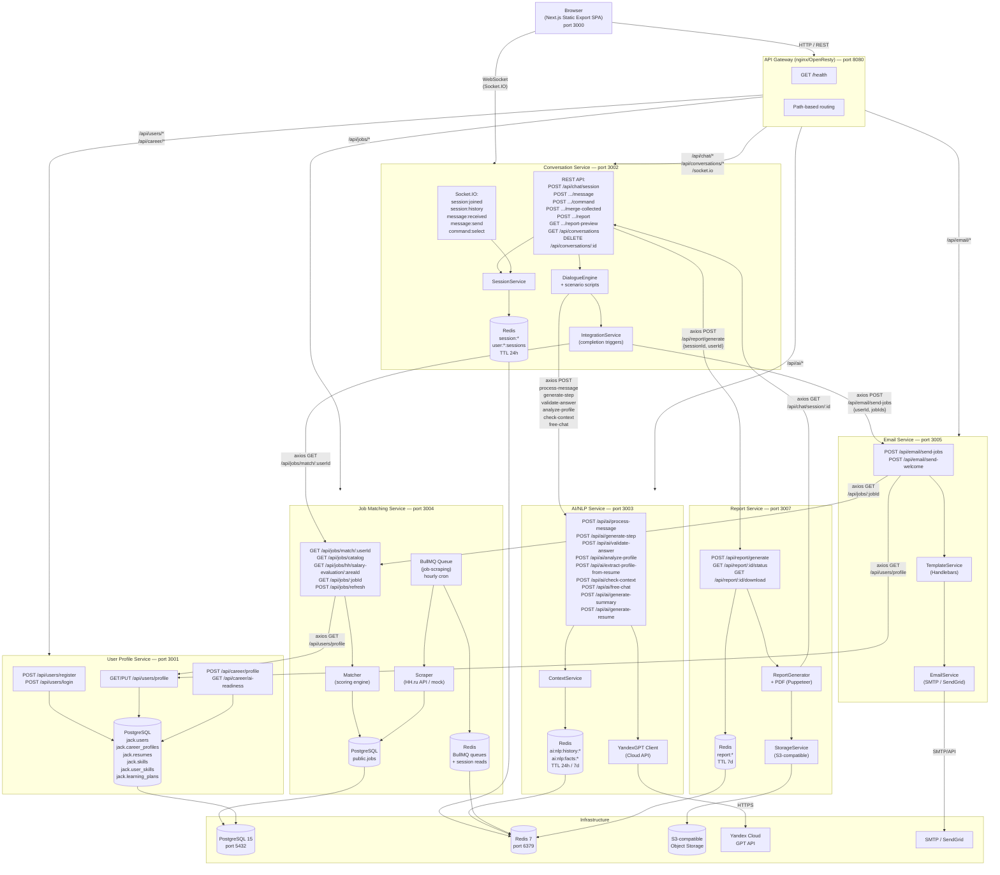
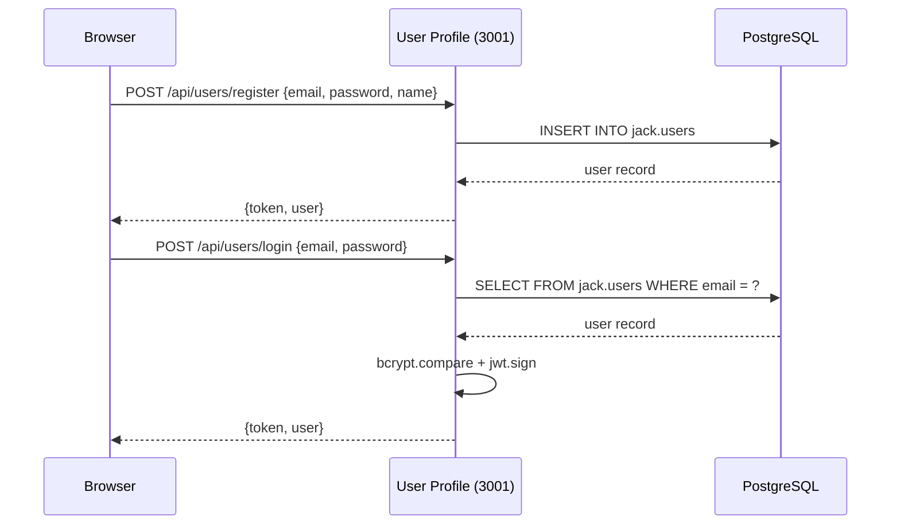
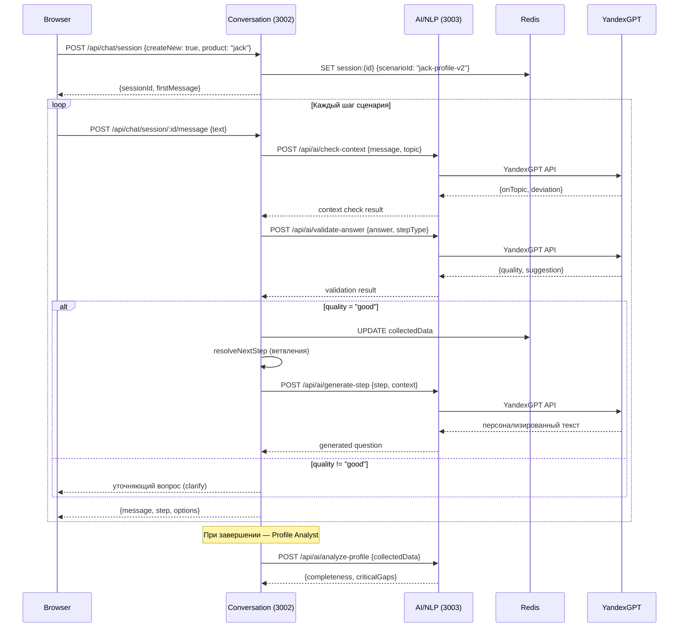
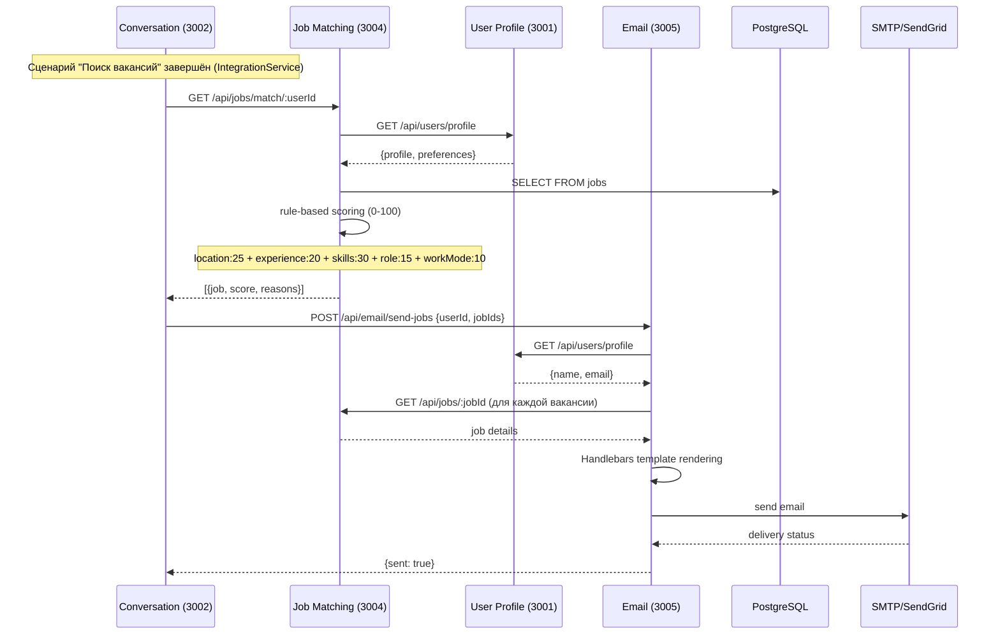
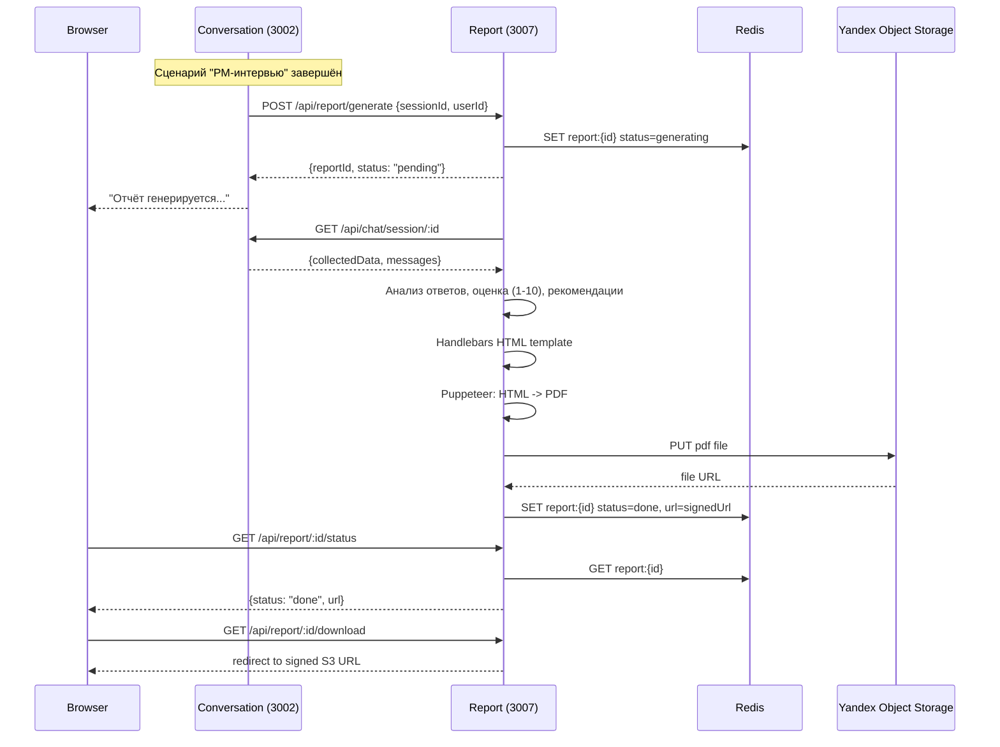
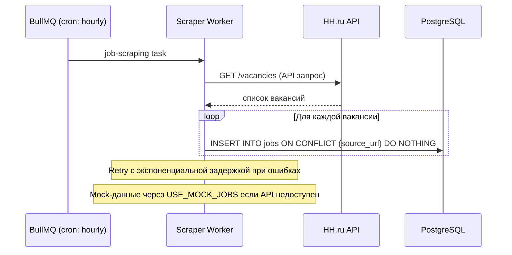

# Техническая архитектура LEO AI

## Обзор

LEO AI — единый AI-продукт для карьерного развития. Внутри продукта реализованы разные пользовательские сценарии:

| Сценарий | Назначение |
|---------|------------|
| **Поиск вакансий** (`jack-profile-v2`) | AI-ассистент для поиска работы. Проводит структурированный диалог с кандидатом, собирает профиль, подбирает вакансии через HH.ru и отправляет персонализированную подборку на email. |
| **PM-интервью** (`wannanew-pm-v1`) | AI-агент для подготовки Product Manager к собеседованиям. Анализирует опыт, проводит пробное интервью, формирует PDF-отчёт с оценкой и рекомендациями. |

Все сценарии используют общую инфраструктуру: единый Conversation Service с регистром сценариев, общую авторизацию (User Profile Service), общий AI/NLP Service (YandexGPT) и единый фронтенд с переключением между сценариями.

Различия реализуются через:
- Разные сценарии диалога (`jack-profile-v2` vs `wannanew-pm-v1`)
- Разные интеграции при завершении (Job Matching + Email для сценария поиска вакансий; Report Generation для сценария PM-интервью)
- Разный брендинг в UI по сценариям

---

## Стек технологий

| Слой | Технологии |
|------|-----------|
| Frontend | Next.js 14 (App Router, Static Export), TypeScript, React 18, Ant Design 5, Tailwind CSS, REST API клиент + Socket.IO (локальная разработка) |
| Backend | Node.js + Express + TypeScript (все сервисы) |
| AI | YandexGPT через Yandex Cloud API |
| База данных | PostgreSQL 15, Redis 7 |
| Очереди | BullMQ (на базе Redis) |
| PDF | Puppeteer + Handlebars |
| Хранилище файлов | Yandex Object Storage (S3-совместимый, AWS SDK) |
| Email | Nodemailer (SMTP/Yandex) + SendGrid fallback |
| Аутентификация | JWT |
| Инфраструктура | Docker Compose (локально), Yandex Cloud Serverless Containers (production) |

---

## Сервисы

| Сервис | Порт | Назначение | Хранилище |
|--------|------|-----------|-----------|
| **Frontend** | 3000 | Next.js SPA (Static Export), REST API клиент, Socket.IO для dev | -- |
| **User Profile** | 3001 | Регистрация, авторизация (JWT), профили пользователей, карьерные профили | PostgreSQL |
| **Conversation** | 3002 | Управление сессиями, движок диалога, регистр сценариев, REST + WebSocket | Redis |
| **AI/NLP** | 3003 | Клиент YandexGPT, мультиагентная система (Validator, Profile Analyst, Context Manager) | Redis |
| **Job Matching** | 3004 | Скрейпер HH.ru, фоновые задачи BullMQ, rule-based скоринг вакансий | PostgreSQL, Redis |
| **Email** | 3005 | Отправка email через SMTP/SendGrid, шаблоны Handlebars | -- |
| **Report** | 3007 | Генерация PDF-отчётов (Puppeteer), загрузка в S3 | Redis, S3 |

---

## Архитектурная диаграмма

**Runtime-модель MVP 0:** фронтенд работает как Next.js Static Export (SPA), production-контур основан на REST + polling. WebSocket используется в локальной разработке.

---

## Межсервисные вызовы

| Источник | Назначение | Метод | Endpoint | Когда |
|----------|-----------|-------|----------|-------|
| Conversation | AI/NLP | POST | `/api/ai/generate-step` | Генерация текста вопроса для шага сценария |
| Conversation | AI/NLP | POST | `/api/ai/validate-answer` | Валидация ответа пользователя (Validator Agent) |
| Conversation | AI/NLP | POST | `/api/ai/analyze-profile` | Анализ полноты профиля при завершении диалога |
| Conversation | AI/NLP | POST | `/api/ai/check-context` | Проверка отклонения от темы (Context Manager) |
| Conversation | AI/NLP | POST | `/api/ai/process-message` | Обработка свободного сообщения пользователя |
| Conversation | AI/NLP | POST | `/api/ai/free-chat` | Свободный режим общения |
| Conversation | AI/NLP | POST | `/api/ai/generate-summary` | Генерация саммари сессии |
| Conversation | AI/NLP | POST | `/api/ai/generate-resume` | Генерация резюме на основе профиля |
| User Profile | AI/NLP | POST | `/api/ai/extract-profile-from-resume` | Извлечение структурированных полей из загруженного PDF/DOCX резюме |
| Conversation | Job Matching | GET | `/api/jobs/match/:userId` | При завершении сценария поиска вакансий (IntegrationService) |
| Frontend Admin | Job Matching | GET | `/api/jobs/catalog` | Просмотр каталога вакансий в БД (debug/admin, токен `JOB_CATALOG_TOKEN`) |
| Frontend Admin | Job Matching | GET | `/api/jobs/hh/salary-evaluation/:areaId` | Проверка доступа и ответов HH Salary Bank (debug/admin) |
| Conversation | Email | POST | `/api/email/send-jobs` | Отправка вакансий после подбора (IntegrationService) |
| Conversation | Report | POST | `/api/report/generate` | При завершении сценария PM-интервью |
| Conversation | Report | POST | `/api/report/preview-compute` | Генерация preview-аналитики без PDF для экранных карточек |
| Job Matching | User Profile | GET | `/api/users/profile` | Получение профиля для скоринга вакансий |
| Email | User Profile | GET | `/api/users/profile` | Получение имени и email для персонализации |
| Email | Job Matching | GET | `/api/jobs/:jobId` | Получение деталей вакансий для шаблона письма |
| Report | Conversation | GET | `/api/chat/session/:id` | Получение collectedData сессии для отчёта |
| AI/NLP | Yandex Cloud | POST | YandexGPT API | Каждый запрос к LLM |
| Job Matching | HH.ru | GET | HH.ru API | Фоновый скрейпинг (BullMQ, раз в час) |
| Report | Yandex Object Storage | PUT | S3 API | Загрузка сгенерированного PDF |

---

## Хранение данных

### PostgreSQL

| Таблица | Сервис | Содержимое |
|---------|--------|-----------|
| `jack.users` | User Profile | Учётные записи: email, password_hash, имя, роль |
| `jack.career_profiles` | User Profile | Карьерные данные: желаемая должность, опыт, локация, режим работы |
| `jack.resumes` | User Profile | Загруженные и сгенерированные резюме |
| `jack.skills` | User Profile | Справочник навыков |
| `jack.user_skills` | User Profile | Связи пользователей с навыками |
| `jack.learning_plans` | User Profile | Планы обучения |
| `public.jobs` | Job Matching | Вакансии: название, компания, локация, зарплата, навыки, source_url (UNIQUE) |

### Redis

| Ключ | Сервис | Содержимое | TTL |
|------|--------|-----------|-----|
| `session:{sessionId}` | Conversation | Полное состояние сессии: шаги, collectedData, product, scenarioId | 24 часа |
| `user:{userId}:session` | Conversation | ID активной сессии пользователя | 24 часа |
| `user:{userId}:sessions` | Conversation | Set всех сессий пользователя | 24 часа |
| `ai:nlp:history:{sessionId}` | AI/NLP | История сообщений для контекста YandexGPT | 24 часа |
| `ai:nlp:facts:{sessionId}` | AI/NLP | Извлечённые факты из диалога | 7 дней |
| `report:{reportId}` | Report | Статус генерации PDF (pending/generating/done/error) | 7 дней |
| BullMQ queues | Job Matching | Очередь задач скрейпинга (job-scraping) | -- |

### S3 (Yandex Object Storage)

| Бакет | Сервис | Содержимое |
|-------|--------|-----------|
| `aiheroes-reports` | Report | PDF-отчёты сценария PM-интервью, доступ через signed URLs |

---

## Ключевые потоки данных

### Регистрация и авторизация

### Сценарий "Поиск вакансий" (сбор профиля)

### Завершение сценария "Поиск вакансий": подбор вакансий и email

### Сценарий "PM-интервью": генерация PDF-отчёта

### Фоновый скрейпинг вакансий

---

## Мультиагентная система (AI/NLP Service)

AI/NLP Service реализует три специализированных агента, работающих через YandexGPT:

| Агент | Endpoint | Назначение | Результат |
|-------|----------|-----------|-----------|
| **Validator** | `/api/ai/validate-answer` | Оценка качества ответа пользователя | `{quality: "good"/"unclear"/"irrelevant", suggestion}` |
| **Profile Analyst** | `/api/ai/analyze-profile` | Анализ полноты собранного профиля | `{completeness, hasGaps, criticalGaps[]}` |
| **Context Manager** | `/api/ai/check-context` | Обнаружение отклонений от темы диалога | `{onTopic, deviation, shouldRedirect, importantInfo}` |

Агенты вызываются из DialogueEngine (Conversation Service) в определённые моменты:
- **Context Manager** — при каждом входящем сообщении
- **Validator** — после проверки контекста, перед сохранением ответа
- **Profile Analyst** — при достижении последнего шага сценария

---

## Сценарии диалога

Conversation Service содержит регистр сценариев с динамической загрузкой:

| Сценарий (UI) | Scenario ID | Шаги | Завершение |
|---------|-------------|------|-----------|
| Поиск вакансий (`product=jack`) | `jack-profile-v2` | Сбор профиля: должность, опыт, навыки, локация, режим работы, зарплата | Job Matching -> Email |
| PM-интервью (`product=wannanew`) | `wannanew-pm-v1` | PM-интервью: уровень, тип продукта, метрики, приоритизация, стейкхолдеры | Report Generation |

Каждый шаг сценария имеет тип: `question`, `info_card` или `command`. Поддерживаются условные ветвления на основе ответов пользователя (числовые, текстовые сравнения, подсчёт элементов).

---

## Деплой и инфраструктура

**Локальная разработка**: Docker Compose поднимает PostgreSQL 15, Redis 7 и опционально pgAdmin. Сервисы запускаются вручную через `npm run dev`. Gateway (nginx/OpenResty) запускается через профиль `--profile gateway`.

**Production**: Yandex Cloud Serverless Containers. Каждый сервис упакован в Docker-контейнер и деплоится как отдельный serverless container. Фронтенд собирается как Static Export и раздаётся из контейнера. WebSocket не поддерживается в serverless-окружении, поэтому production использует исключительно REST API с polling (каждые 3 секунды).

**Переменные окружения**: все сервисы валидируют обязательные переменные при старте. Ключевые группы:
- YandexGPT: `YC_FOLDER_ID`, `YC_API_KEY`, `YC_MODEL_ID`
- Database: `DB_HOST`, `DB_PORT`, `DB_NAME`, `DB_USER`, `DB_PASSWORD`
- Redis: `REDIS_HOST`, `REDIS_PORT`
- S3: `YC_STORAGE_BUCKET`, `YC_STORAGE_ACCESS_KEY`, `YC_STORAGE_SECRET_KEY`, `YC_STORAGE_ENDPOINT`
- Email: `SENDGRID_API_KEY` или SMTP-конфигурация
- Service URLs: `USER_PROFILE_SERVICE_URL`, `CONVERSATION_SERVICE_URL`, `AI_SERVICE_URL` и др.
