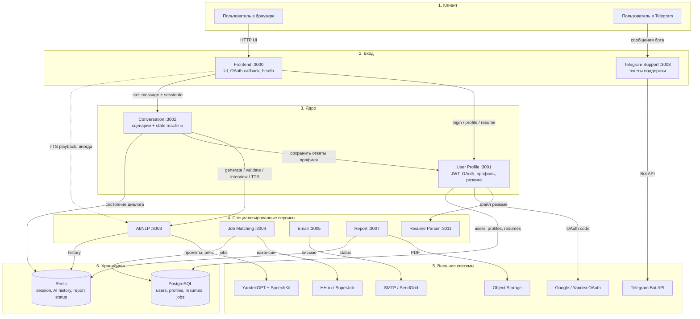
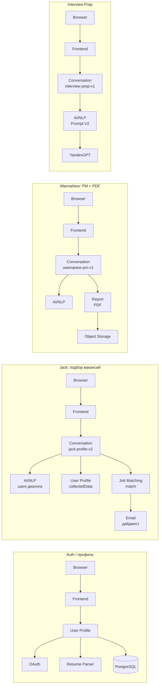

# Техническая архитектура LEO AI

*Актуально на 2026-05-27*

## 1. Обзор системы

LEO AI — микросервисная платформа (Node.js + Express + TypeScript) с общим AI-контуром (YandexGPT, SpeechKit TTS).

### Стек

| Слой | Технологии |
|------|------------|
| Frontend | Next.js 14 (App Router), Ant Design, Tailwind |
| Backend | Node.js, Express, TypeScript |
| AI | YandexGPT, SpeechKit TTS, Interview Prep Prompt V2 |
| Data | PostgreSQL, Redis (сессии, BullMQ) |
| Storage | Yandex Object Storage (PDF) |
| Infra | Docker Compose, VPS (Cloud.ru), Caddy (HTTPS) |
| Observability | Sentry, PostHog |

---

## 2. Карта сервисов

| Сервис | Порт | Назначение |
|--------|------|------------|
| **Frontend** | 3000 | Next.js, чат, лендинг, OAuth callback |
| **User Profile** | 3001 | Auth (JWT, OAuth), профили, резюме |
| **Conversation** | 3002 | Диалоговый движок, сценарии, WebSocket/REST |
| **AI/NLP** | 3003 | YandexGPT, TTS, Interview Prep, агенты |
| **Job Matching** | 3004 | HH/SuperJob, scoring |
| **Email** | 3005 | SMTP / SendGrid, дайджесты |
| **Report** | 3007 | PDF (Puppeteer), S3 |
| **Telegram Support** | 3008 | Бот [@leoaisupportbot](https://t.me/leoaisupportbot) |
| **Resume Parser** | 3011 | Docker: извлечение текста из PDF/DOCX |

Запуск локально / на VPS: `npm run dev:up` (см. [OPERATIONS.md](./OPERATIONS.md)).

### Инфопотоки (линейные пути)

Рисунок (слои + продуктовые пайплайны): [assets/leoai-architecture-infoflow.png](./assets/leoai-architecture-infoflow.png)

Идея схемы: **сверху вниз** — кто с кем говорит; **отдельные пайплайны** — куда уходят данные по продукту. Без «паутины» всех стрелок сразу.

#### A. Слои системы (кто кого вызывает)

```mermaid
flowchart TB
  subgraph L1["1. Клиент"]
    U[Пользователь в браузере]
    T[Пользователь в Telegram]
  end

  subgraph L2["2. Вход"]
    FE["Frontend :3000<br/>UI, OAuth callback, health"]
    TGS["Telegram Support :3008<br/>тикеты поддержки"]
  end

  subgraph L3["3. Ядро"]
    UP["User Profile :3001<br/>JWT, OAuth, профиль, резюме"]
    Conv["Conversation :3002<br/>сценарии + state machine"]
  end

  subgraph L4["4. Специализированные сервисы"]
    AI["AI/NLP :3003"]
    JM["Job Matching :3004"]
    Mail["Email :3005"]
    Rep["Report :3007"]
    RP["Resume Parser :3011"]
  end

  subgraph L5["5. Внешние системы"]
    OAuth[Google / Yandex OAuth]
    YGPT[YandexGPT + SpeechKit]
    HH[HH.ru / SuperJob]
    S3[Object Storage]
    TGAPI[Telegram Bot API]
    SMTP[SMTP / SendGrid]
  end

  subgraph L6["6. Хранилища"]
    PG[(PostgreSQL<br/>users, profiles, resumes, jobs)]
    RD[(Redis<br/>session, AI history, report status)]
  end

  U -->|HTTP UI| FE
  T -->|сообщения бота| TGS
  TGS -->|Bot API| TGAPI

  FE -->|login / profile / resume| UP
  FE -->|чат: message + sessionId| Conv
  FE -.->|TTS playback, иногда| AI

  UP -->|файл резюме| RP
  UP -->|OAuth code| OAuth
  UP -->|users, profiles, resumes| PG

  Conv -->|generate / validate / interview / TTS| AI
  Conv -->|сохранить ответы профиля| UP
  Conv -->|состояние диалога| RD

  AI -->|промпты, речь| YGPT
  AI -->|history| RD

  JM -->|вакансии| HH
  JM -->|jobs| PG
  Mail -->|письмо| SMTP
  Rep -->|PDF| S3
  Rep -->|status| RD
```

#### B. Продуктовые пайплайны (что куда уходит)

```mermaid
flowchart LR
  subgraph Auth["Auth / профиль"]
    direction TB
    A1[Browser] --> A2[Frontend] --> A3[User Profile]
    A3 --> A4[OAuth]
    A3 --> A5[Resume Parser]
    A3 --> A6[(PostgreSQL)]
  end

  subgraph Jack["Jack: подбор вакансий"]
    direction TB
    J1[Browser] --> J2[Frontend] --> J3[Conversation<br/>jack-profile-v2]
    J3 --> J4[AI/NLP<br/>шаги диалога]
    J3 --> J5[User Profile<br/>collectedData]
    J3 --> J6[Job Matching<br/>match]
    J6 --> J7[Email<br/>дайджест]
  end

  subgraph Wanna["WannaNew: PM + PDF"]
    direction TB
    W1[Browser] --> W2[Frontend] --> W3[Conversation<br/>wannanew-pm-v1]
    W3 --> W4[AI/NLP]
    W3 --> W5[Report<br/>PDF]
    W5 --> W6[Object Storage]
  end

  subgraph Prep["Interview Prep"]
    direction TB
    P1[Browser] --> P2[Frontend] --> P3[Conversation<br/>interview-prep-v1]
    P3 --> P4[AI/NLP<br/>Prompt V2]
    P4 --> P5[YandexGPT]
  end
```

| Пайплайн | Данные на входе | Куда уходят на выходе |
|----------|-----------------|----------------------|
| **Auth** | email/OAuth, файл резюме | `jack.users` / `career_profiles` / `resumes` в PostgreSQL |
| **Jack** | ответы чата → профиль | матч вакансий → email-дайджест; jobs в PostgreSQL |
| **WannaNew** | ответы чата PM | PDF-отчёт → Object Storage; status в Redis |
| **Interview Prep** | ответы / режим | только AI-контур (диалог + feedback), без matching |
| **Support** | текст в Telegram | Telegram Bot API (вне основного продукта) |

**Правило оркестрации:** GPT и TTS только через **AI/NLP**; matching / email / PDF — только из **Conversation** по завершению сценария (`integrationService`), не из Frontend напрямую.
### Health

- Каждый сервис: `GET /health`
- Агрегатор на стенде: `GET https://leo-ai.ru/api/health` (Next.js route, опрашивает все сервисы на `127.0.0.1`)

---

## 3. Мультиагентная система (AI/NLP)

Специализированные агенты и режимы:

- **Validator** — качество ответа пользователя
- **Profile Analyst** — полнота профиля
- **Context Manager** — отклонение от темы
- **Interview Prep (Prompt V2)** — режимы `diagnostics`, `theory`, `case`, `mock`, `star`, `employer_questions`; role packs PM/Product, Analytics/Data — см. [INTERVIEW_TRAINER_PROMPT_V2.md](./INTERVIEW_TRAINER_PROMPT_V2.md)

Ключевые API:

- `POST /api/ai/generate-step`, `validate-answer`, `analyze-profile`, …
- `POST /api/ai/tts` — синтез речи (Yandex SpeechKit)
- `POST /api/ai/interview/*` — подготовка к собеседованию

---

## 4. Сценарии (Conversation)

| ID | Продукт | Завершение |
|----|---------|------------|
| `jack-profile-v2` | Jack | Job Matching → Email |
| `wannanew-pm-v1` | WannaNew | Report Service → PDF |

WannaNew: `integrationService` не вызывает matching для `product=wannanew`; отчёт по кнопке / статусу сессии.

Подробнее: [HISTORY/WANNANEW.md](./HISTORY/WANNANEW.md)

---

## 5. Голос

| Направление | Реализация | Статус |
|-------------|------------|--------|
| **TTS** (озвучка LEO) | `ai-nlp` → Yandex SpeechKit; фронт воспроизводит base64 | Production baseline |
| **STT** (ввод пользователя) | `webkitSpeechRecognition` в `frontend/app/chat/page.tsx` | Chrome; server STT — backlog MVP1 |

Опционально: `NEXT_PUBLIC_ENABLE_BROWSER_TTS_FALLBACK=true` — браузерный `speechSynthesis` если серверный TTS недоступен.

---

## 6. Модель данных

### PostgreSQL

- `jack.users` — аккаунты, OAuth IDs
- `jack.career_profiles` — роли, опыт, локация
- `jack.resumes` — файлы и распарсенные данные
- `public.jobs` — вакансии (HH/SuperJob)

### Redis

- `session:{id}` — состояние чата
- `ai:nlp:history:{id}` — контекст YandexGPT
- `report:{id}` — статус PDF

---

## 7. Внешние интеграции

| Интеграция | Где |
|------------|-----|
| OAuth Google / Yandex | `user-profile` |
| YandexGPT + SpeechKit TTS | `ai-nlp` |
| HH.ru / SuperJob | `job-matching` |
| Yandex Object Storage | `report` |
| Telegram Bot API | `telegram-support` (proxy на VPS в РФ) |
| Sentry | все сервисы + frontend |
| PostHog | frontend |

---

## 8. Reverse proxy (production)

Caddy на VPS проксирует `leo-ai.ru` → frontend (порт **3011** в текущем runbook; Next dev/build слушает согласно `dev:up:staging`).

См. [OPERATIONS.md](./OPERATIONS.md), [STAGING_DEPLOY.md](./STAGING_DEPLOY.md).
