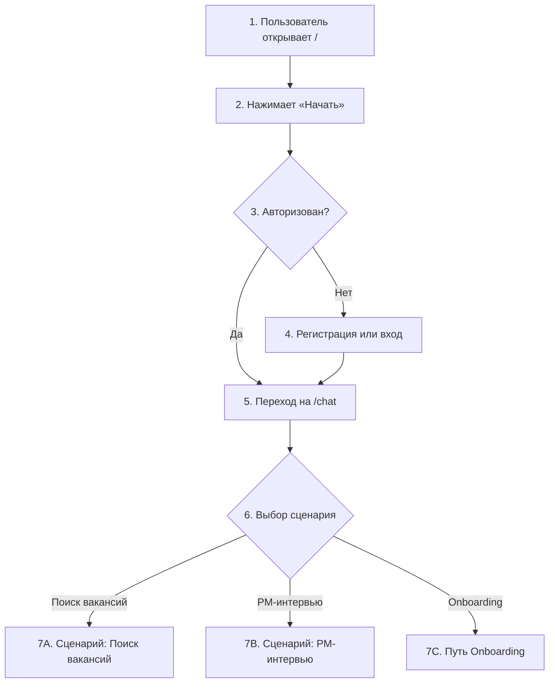
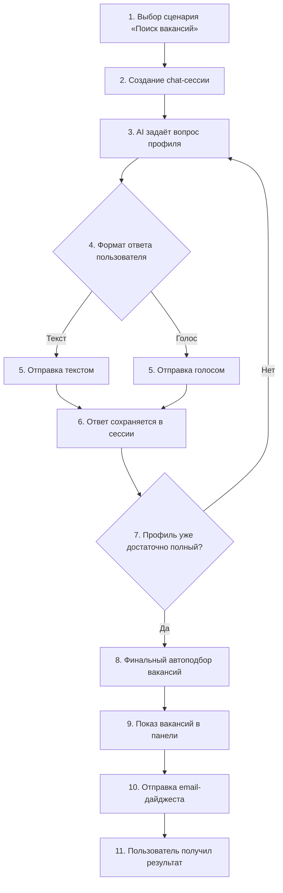
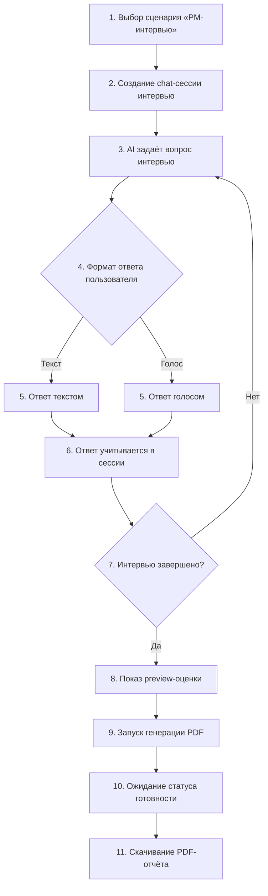
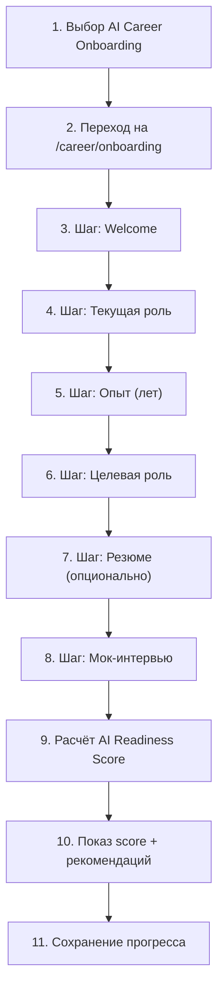
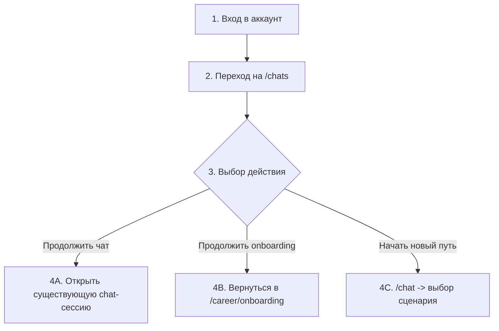

# Клиентские пути пользователя (прозрачная версия)

Этот документ нужен, чтобы новый человек за 2-3 минуты понял:

1. Что делает продукт.
2. Какие есть пользовательские пути.
3. Какие шаги проходит пользователь в каждом пути.
4. Какой результат получает в конце.

## 1) Что это за продукт

LEO AI - это один продукт с тремя пользовательскими сценариями:

- **Сценарий "Поиск вакансий"** (технический id: `jack`) - помогает собрать профиль и получить подборку вакансий.
- **Сценарий "PM-интервью"** (технический id: `wannanew`) - проводит PM-интервью и формирует отчёт.
- **AI Career Onboarding** - оценивает AI-готовность и даёт рекомендации.

## 2) Единый путь входа (для всех сценариев)

## 3) Полные схемы шагов (все шаги)

Ниже именно **полные** схемы, не укороченные.

### A) Полная схема сценария "Поиск вакансий"

### B) Полная схема сценария "PM-интервью"

### C) Полная схема AI Career Onboarding

### D) Полная схема возвращающегося пользователя

## 4) Подробные шаги по каждому сценарию (текстом)

### A. Сценарий "Поиск вакансий"

**Цель пользователя:** получить подходящие вакансии и письмо с подборкой.

**Шаги:**
1. Пользователь выбирает сценарий **Поиск вакансий** на экране выбора.
2. Создаётся чат-сессия этого сценария.
3. AI задаёт вопросы о профиле (роль, опыт, навыки, локация и т.д.).
4. Пользователь отвечает текстом или голосом.
5. После значимых ответов система обновляет подбор вакансий в фоне.
6. Пользователь видит карточки вакансий в правой панели.
7. Когда профиль достаточно собран, выполняется финальный подбор.
8. Сервис отправляет email-дайджест с вакансиями.

**Результат:**
- релевантные вакансии на экране;
- письмо на email с подборкой.

---

### B. Сценарий "PM-интервью"

**Цель пользователя:** пройти интервью-тренировку и получить отчёт.

**Шаги:**
1. Пользователь выбирает сценарий **PM-интервью**.
2. Создаётся чат-сессия интервью.
3. AI последовательно проводит PM-интервью по шагам.
4. Пользователь отвечает в чате (текст/голос).
5. После завершения показывается preview-оценка на экране.
6. Пользователь запускает генерацию PDF-отчёта.
7. После готовности скачивает отчёт.

**Результат:**
- экранный preview результатов;
- PDF-отчёт с оценкой и рекомендациями.

---

### C. Путь AI Career Onboarding

**Цель пользователя:** понять свою AI-готовность и получить рекомендации развития.

**Шаги:**
1. Пользователь выбирает **AI Career Onboarding**.
2. Переходит в мастер `/career/onboarding`.
3. Проходит шаги (база профиля -> опыт -> цель -> резюме -> мок-интервью).
4. По желанию загружает резюме (файл).
5. Система рассчитывает AI Readiness Score.
6. Пользователь получает персональные рекомендации.
7. Прогресс сохраняется, можно вернуться позже.

**Результат:**
- AI Readiness Score;
- список следующих шагов для развития.

## 5) Что пользователь получает в конце (коротко)

| Сценарий | Финальный результат |
|---|---|
| **Сценарий "Поиск вакансий"** | Подбор вакансий + email-дайджест |
| **Сценарий "PM-интервью"** | Preview + PDF-отчёт |
| **Onboarding** | AI Readiness Score + рекомендации |

## 6) Как читать этот документ

Если нужно быстро понять продукт:

1. Сначала смотри раздел **2** (единый вход).
2. Потом раздел **3** (нужный сценарий).
3. В конце раздел **5** (что получает пользователь).
