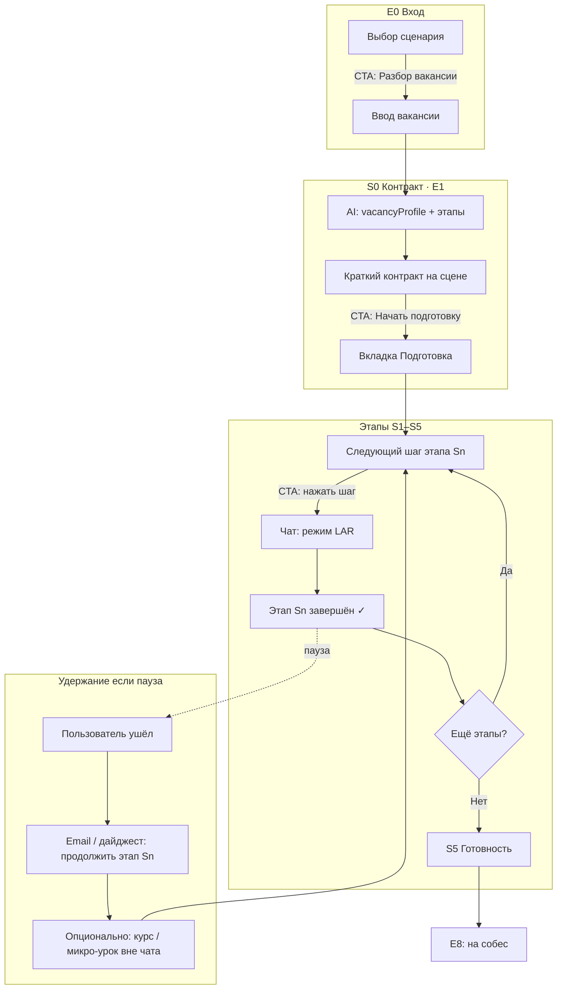

# Interview Prep — CJM v1.4

**Версия:** 1.4  
**Дата:** 2026-06-30  
**Статус:** Продуктовый артефакт (воркшоп: продукт + персона Алексей, Senior PO B2B)  
**Связь:** дополняет [`INTERVIEW_PREP_METHODOLOGY.md`](./INTERVIEW_PREP_METHODOLOGY.md) v1.3 → v1.4  
**Companion:** [`INTERVIEW_PREP_VALUE_AND_IA.md`](./INTERVIEW_PREP_VALUE_AND_IA.md)

---

## 0. Ключевое изменение v1.4: этапы, не дни

| v1.3 | v1.4 |
|------|------|
| Маршрут = **5 календарных дней** | Маршрут = **последовательность этапов** |
| «Сегодня · День N» | **«Следующий шаг»** / «Этап N из M» |
| Прогресс «2/5 дней» | Прогресс **«3/6 этапов»** или **«~2 ч из ~4 ч»** |
| План на 5 дней — главный объект | План этапов — главный; **календарь — опциональный ритм возврата** |

**Два режима прохождения (оба валидны):**

1. **Спринт** — кандидат садится на 2–4 часа и проходит несколько этапов подряд.
2. **Марафон** — кандидат делает по 1 этапу в день; LEO **возвращает** через напоминания, дайджест, «продолжить с этапа X».

Календарные дни — **не учебная единица**, а **канал удержания** (email, push, «завтра этап 3»), если пользователь ушёл.

---

## 1. Маршрут по этапам (продуктовая модель)

Этап = логический блок с **чётким исходом** (PACK) и **1–3 шагами** в чате.

| # | Этап | Исход (ценность) | Шаги (типично) | Оценка времени |
|---|------|------------------|----------------|----------------|
| **S0** | Контракт | «LEO понял вакансию» | — (только просмотр) | 3–5 мин |
| **S1** | Диагностика | Карта пробелов | 1× Практика (диагностика) | 20–30 мин |
| **S2** | Закрытие пробелов | Урок + мини-проверка | 1–2× Учёба (теория) | 20–40 мин |
| **S3** | Практика | STAR и/или кейс с разбором | 1–2× Практика | 30–50 мин |
| **S4** | Репетиция | Мок 3 вопроса + debrief | 1× Итог (мок) | 40–50 мин |
| **S5** | Готовность | PDF, вопросы работодателю, чеклист | 1× Упаковка | 15–20 мин |

**Полный маршрут:** ~2,5–4 ч чистого времени в чате (спринт за вечер возможен).

**Гейт мока (S4):** как в методологии — диагностика ✓, N уроков, ≥1 STAR с разбором. Формулировка в UI: «Этап „Репетиция“ откроется после…», не «на 5-й день».

---

## 2. CJM v2 — действия и CTA (без контента карточек)

### Таблица этапов CJM × этапы маршрута

| CJM | Цель пользователя | Этап маршрута | Primary CTA | Экран | Метрика успеха |
|-----|-------------------|---------------|-------------|-------|----------------|
| E0 | Выбрать путь | — | «Разбор вакансии» | Вход | Начал ввод вакансии |
| E1 | Доверие к разбору | S0 Контракт | **«Начать подготовку»** | Сценарий | CTA &lt; 3 мин после карточки |
| E2 | Понять, что делать | S1… | **Клик по следующему шагу** | Подготовка | ≥1 шаг этапа начат |
| E3 | Learn | S2 | Ответ в чате / «готов» | Сценарий + Чат | Этап S2 ✓ |
| E4 | Диагностика | S1 | Ответы в чате | Сценарий + Чат | Карта пробелов |
| E5 | Практика | S3 | Кейс / STAR | Сценарий + Чат | ≥1 разбор с Rescue |
| E6 | Мок | S4 | «Начать мок» | Сценарий | Мок завершён |
| E7 | Артефакты | S5 | PDF / вопросы | Подготовка | PDF скачан |
| E8 | Выход | S5 | Чеклист (будущее) | Подготовка | Self-check |

### Mermaid — маршрут по этапам

---

## 3. Воркшоп: Алексей (Senior PO) на E1

| Момент | Мысль | Эмоция | Риск |
|--------|-------|--------|------|
| Видит «план на 5 дней» | «У меня собес послезавтра, мне не нужен календарь» | Раздражение | E1 |
| Видит «0/5 дней» | «Меня оценивают до действия» | Демотивация | E2 |
| Не видит «сколько займёт» | «2 часа или 2 недели?» | Неопределённость | E1 |
| **Желаемое v1.4** | «6 этапов, ~3 часа, начни с диагностики — 25 мин» | Облегчение | — |

**Инсайт:** Алексей мыслит **этапами и временем**, не **днями**. Дни нужны только если он закрыл вкладку до мока.

---

## 4. Intro-copy (E0, E1, E2) — v1.4

**E0 — выбор сценария**

> Подготовка к **конкретной вакансии**: пришлите текст — LEO разберёт требования и соберёт маршрут из этапов (диагностика → уроки → практика → мок). Можно пройти за один вечер (~3 ч) или по одному этапу в день — как удобно.

**E1 — после разбора (Сценарий)**

> **{Роль} · {уровень}** — маршрут из **{M} этапов**, ориентир **~{X} ч** в чате.  
> Следующий шаг: **{название этапа S1}** (~{Y} мин). Подробный разбор вакансии — ниже, по желанию.

**E2 — вкладка Подготовка**

> **Этап {n} из {M}: {название}** — {фокус}.  
> Нажмите шаг ниже — LEO откроет чат. Остальные этапы и разбор вакансии — свёрнуты ниже.

---

## 5. Удержание и возврат (календарный слой)

Когда пользователь **не** проходит маршрут за одну сессию:

| Триггер | Действие LEO | Канал |
|---------|--------------|-------|
| Не заходил 24 ч после этапа Sn | «Продолжить: {название этапа Sn+1}, ~{Y} мин» | Email / push (будущее) |
| Застрял на этапе (шаг начат, не завершён) | Rescue + напоминание с контекстом пробела | In-app |
| Между S2 и S3 | Опционально: **микро-курс** / статья по топ-пробелу (вне чата) | Ссылка в Подготовке |
| После S5 | Дайджест «готов к собесу» + PDF | Email |

**Продуктовый принцип:** курсы и внешний контент — **дополнение к этапу**, не замена чату. CTA всегда ведёт обратно в **следующий шаг** маршрута.

**Рекомендуемый темп (мягкий, не обязательный):**  
«Если собес через неделю — ~1 этап в день. Если через 2 дня — можно пройти за вечер.»

---

## 6. Чеклист UI (v1.4)

### Переименовать в интерфейсе

| Было | Стало |
|------|-------|
| Сегодня · День N | **Этап N: {название}** |
| 0/5 дней · 0% | **Этап 1 из 6** или **~0 ч из ~3 ч** |
| План подготовки (5 дней) | **Маршрут этапов** (свёрнут) |
| План на 5 дней | **Все этапы** (accordion) |

### Убрать / свернуть

См. [`INTERVIEW_PREP_VALUE_AND_IA.md`](./INTERVIEW_PREP_VALUE_AND_IA.md) — без изменений по сути; акцент на **следующий шаг этапа**, не «день».

### Добавить (продукт)

- Ориентир **~X ч** на весь маршрут (после S0).
- Подпись **«Можно пройти за один вечер или по этапу в день»**.
- При паузе &gt; 24 ч — баннер **«Продолжить с этапа N»** (in-app; email — позже).

---

## 7. Mapping: этапы ↔ текущая реализация (для имплементации)

Сейчас в коде: `prepPlan` с `day: 1..5`, `PrepTodayPanel`, `currentDay`.  
**v1.4 UX** не требует сразу менять бэкенд — достаточно **переименования и группировки** в UI:

| Этап v1.4 | Текущий `day` (временно) | Будущее (опционально) |
|-----------|--------------------------|------------------------|
| S1 Диагностика | day 1 (часть) | `stageId: diagnostics` |
| S2 Learn | day 1–2 theory | `stageId: learn` |
| S3 Практика | day 2–4 | `stageId: practice` |
| S4 Мок | day 5 | `stageId: mock` |
| S5 Pack | employer + PDF | `stageId: pack` |

---

## 8. Изменения в методологии (патч к v1.3)

Для merge в `INTERVIEW_PREP_METHODOLOGY.md`:

1. **Манифест:** «маршрут из этапов», не «на 5 дней».
2. **§1.1:** `prepPlan` = последовательность **этапов**; дни — опциональный **cadence** для retention.
3. **§2.1:** Подготовка показывает **следующий этап**, не календарь.
4. **§3.2 E1/E2:** обновить по таблице §2 этого документа.
5. **§5:** переименовать «5 дней» → «этапы маршрута (шаблон 5–6 этапов)»; подсекция **§5.4 Рекомендуемый календарный темп**.
6. **§новый Retention:** email, курсы, «продолжить этап».

---

## 9. Backlog имплементации (после утверждения)

**P0 — смысл (без смены схемы данных)**
1. Copy E0/E1/E2 (этапы + ~часы).
2. UI: «Этап N» / «Следующий шаг» вместо «День N» / «Сегодня».
3. Прогресс: `этап X из M` + опционально `~ч из ~ч`.
4. IA: следующий шаг on top; маршрут этапов — accordion.
5. Скрыть пустые артефакты и лишние режимы на старте.

**P1 — удержание**
6. In-app «Продолжить с этапа N» при возврате.
7. Email-дайджест с этапом (сервис `email`).
8. Блок «Рекомендуемый темп» (1 этап/день vs спринт).

**P2 — модель данных**
9. `prepStages[]` вместо привязки к `day` в `collectedData`.
10. Микро-курсы / ссылки по пробелу (контент вне чата).

**North Star (пилот):** % сессий с **завершённым этапом S1** в течение 24 ч после S0.

---

## 10. Решения воркшопа (зафиксировано)

| Вопрос | Решение |
|--------|---------|
| Единица маршрута | **Этап**, не календарный день |
| Спринт за вечер | Поддерживаем явно в copy и UX |
| Дни | Только **ритм возврата** и удержание |
| Курсы | Дополнение между этапами, CTA → обратно в чат |
| MVP ценности | Завершён **этап S1** (диагностика) |
