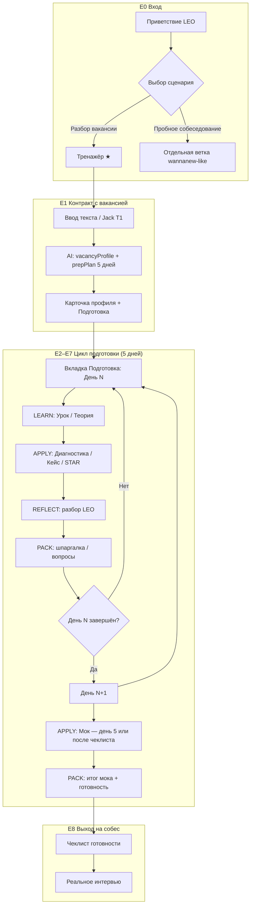
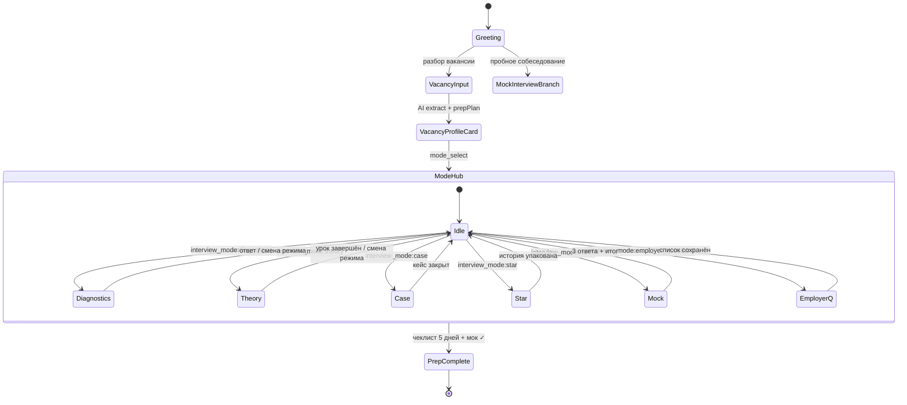
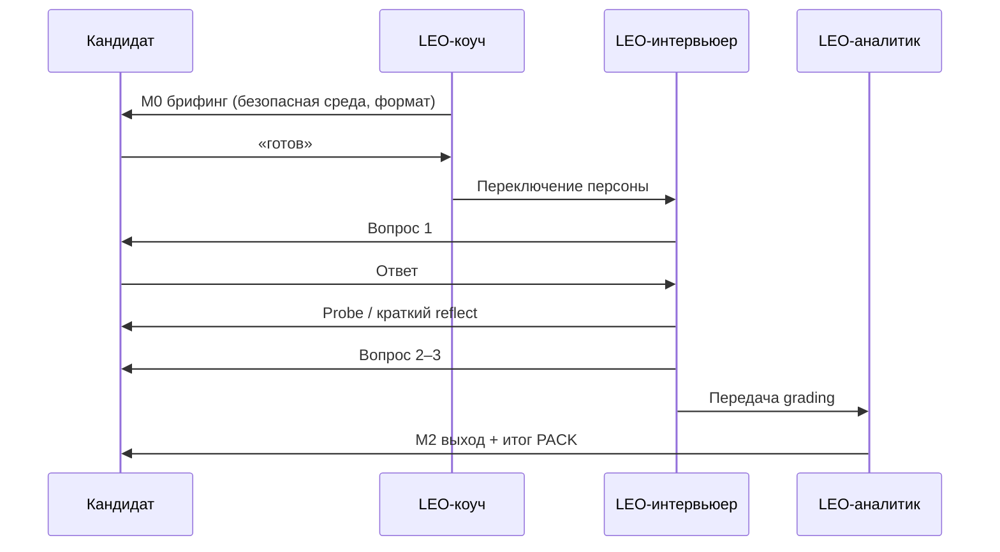
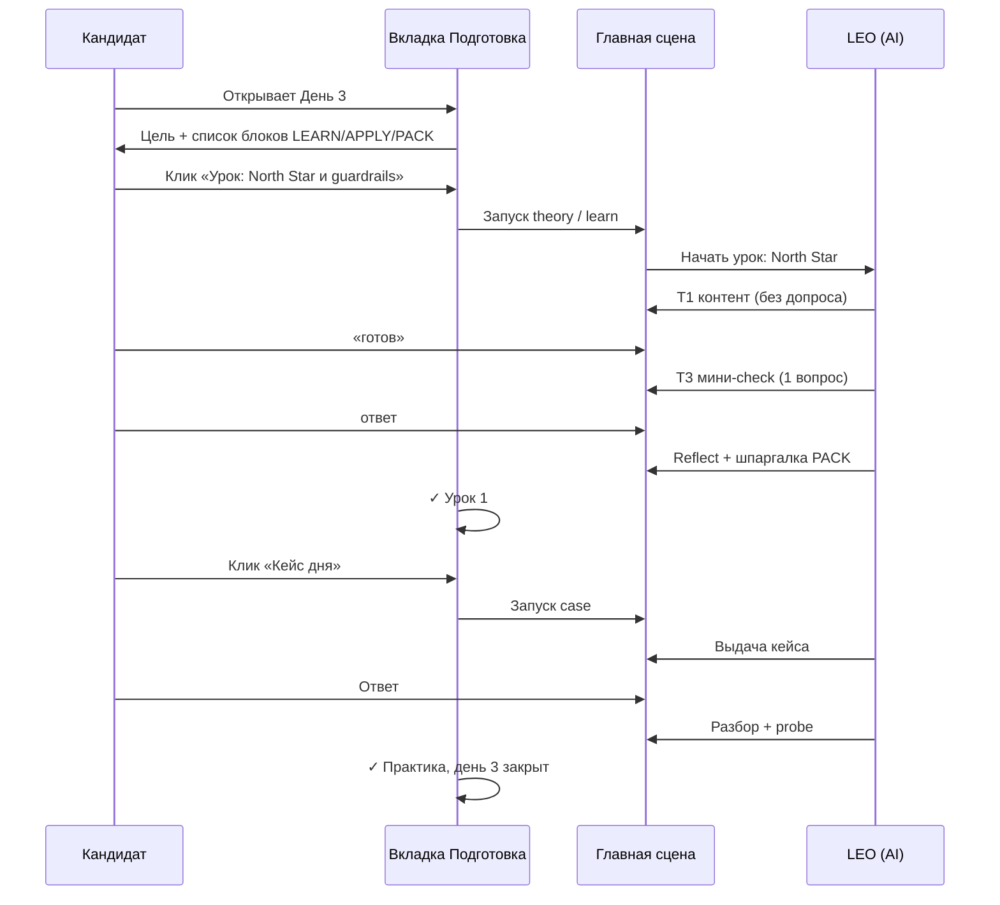
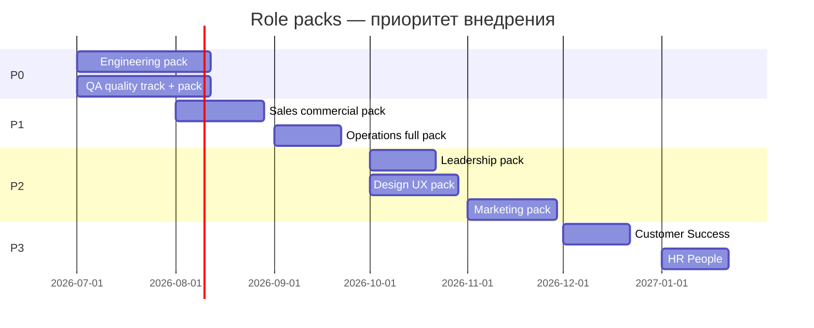

# Методология подготовки к собеседованию в LEO Interview

**Версия:** 1.2  
**Дата:** 2026-06-22  
**Статус:** Продуктовая методология (вкладка «Подготовка» + тренажёр по вакансии)  
**Аудитория:** продукт, контент, промпт-инженерия, UX, дизайн, аналитика

---

## Манифест

LEO Interview — **не чат с вопросами**, а тренажёр подготовки к **конкретной вакансии**.

Мы начинаем с текста вакансии, строим персональный маршрут на 5 дней и ведём кандидата через цикл **обучения → практики → разбора → артефактов** — а не через бесконечный допрос.

LEO учит **до** того, как проверяет: сначала урок и рамка, потом ответ и честная обратная связь. После слабого ответа — не молчание и не унижение, а протокол **rescue**: коуч возвращает структуру и даёт вторую попытку.

Три поверхности продукта работают вместе: **Подготовка** — маршрут коуча; **главный экран** — текущий шаг; **чат** — память по режимам. На выходе кандидат забирает **PDF-отчёт** — карту пробелов, упакованные STAR, вопросы работодателю и чеклист готовности.

Методология универсальна по **пути обучения** (LAR, 6 режимов, CJM) и персонализируется по **роли вакансии** (role pack) и **уровню кандидата** (junior → lead). Один и тот же продукт готовит PO, разработчика, аналитика и sales-менеджера — разным контентом, одной педагогикой.

---

## 0. Зачем этот документ

LEO Interview — не «чат с вопросами». Это **адаптивный тренажёр**, который ведёт кандидата от конкретной вакансии к уверенному выходу на реальное собеседование.

Методология отвечает на три вопроса:

1. **Чему** учим — компетенции, извлечённые из вакансии, а не абстрактный «курс PM».
2. **Как** учим — чередование объяснения (коуч), закрепления (практика) и артефактов (шпаргалки).
3. **Где** в продукте — главный экран, вкладка «Подготовка», треды истории, режимы тренажёра.

Документ связывает педагогику карьерного коуча с текущей архитектурой (`interview-prep-v1`, Prompt V2, шесть режимов).

---

## 1. Философия обучения

### 1.1. Принцип «вакансия — учебный план»

Каждая сессия начинается с **профиля вакансии** (`vacancyProfile` + `prepPlan` на 5 дней).  
LEO не обучает «продукт-менеджменту вообще» — он закрывает **разрыв между кандидатом и этой ролью в этой компании**.

| Вход | Что строим |
|------|------------|
| Текст вакансии | Карта компетенций (hard / soft / контекст) |
| Уровень (senior, lead…) | Планка ожиданий в ответах |
| Домен (B2B, ML, финтех…) | Словарь и кейсы |
| Пробелы кандидата (диагностика) | Приоритет тем в плане |

### 1.2. Модель обучения: **Learn → Apply → Reflect → Pack**

Классическая ошибка интервью-тренажёров — сразу **Apply** (вопрос в лоб).  
У взрослого кандидата без Learn растёт тревога и «вода» в ответах.

```
Learn     — LEO-коуч объясняет рамку (теория, микро-урок)
Apply     — кандидат отвечает (кейс, STAR, диагностика, мок)
Reflect   — LEO разбирает: что сработало, что усилить
Pack      — артефакт: шпаргалка, вопрос работодателю, STAR-история в заметке
```

Цикл повторяется **внутри каждого дня** и **внутри каждой компетенции**.

### 1.3. Две персоны LEO (обязательное разделение в промптах)

| Персона | Когда | Тон | Запрещено |
|---------|-------|-----|-----------|
| **LEO-коуч** | Теория, ввод после диагностики, разбор после слабого ответа (обучающий слой) | Спокойный наставник, структура, примеры | Допрос без объяснения |
| **LEO-интервьюер** | Кейс (выдача), мок, жёсткий follow-up | Hiring manager, давление, один вопрос | Подсказывать ответ |
| **LEO-аналитик** | Итог диагностики, итог мока, карта пробелов | Честная оценка, приоритеты | Мотивационные речи |

Сейчас Prompt V2 смешивает персоны в одном «strict coach» — методология требует **явного переключения** по типу активности.

### 1.4. Три типа активности в продукте

| Код | Название в UI | Суть | Режимы |
|-----|---------------|------|--------|
| `LEARN` | **Урок** | Контент для изучения, без оценки | Теория (ход 1), справочные блоки |
| `APPLY` | **Практика** | Ответ кандидата + оценка | Диагностика, Кейс, STAR, Мок |
| `PACK` | **Артефакт** | Сохранить и перечитать | Вопросы работодателю, карта пробелов, шпаргалки |

### 1.5. Адаптация под уровень кандидата (seniority)

Персонализация — **два оси**: роль вакансии (role pack) и **уровень кандидата** относительно вакансии.  
В коде: `inferSeniority()` + `buildSeniorityPrompt()`; в продукте — поле `level` в `vacancyProfile` и сигналы из диагностики.

**Источники уровня (приоритет):**

1. Явный уровень в вакансии (junior / middle / senior / lead).
2. Ответы в диагностике (опыт, scope, метрики в STAR).
3. Оценки `seniorityFit` в grading V2.

#### Матрица «уровень × интенсивность фаз LAR»

Шкала: **1** = минимум, **3** = максимум. ★ = отличие от базового сценария.

| Фаза | Junior | Middle | Senior | Lead |
|------|:------:|:------:|:------:|:----:|
| **Learn** (объём уроков) | ★3 | 2 | 1–2 | 1 |
| **Learn** (глубина) | Базовые рамки, больше примеров | Стандарт | Точечные пробелы | Только edge-cases |
| **Apply** (давление) | 1 | 2 | ★3 | ★3 |
| **Apply** (сложность кейса) | Узкий scope | Средний | Полный | Орг. + системный |
| **Reflect** (жёсткость) | Мягче, больше структуры | Стандарт | Жёстче, меньше подсказок | Фокус на judgment |
| **Pack** (детализация) | ★3 шаблоны | Стандарт | Чеклисты | Стратегические вопросы |
| **Мок** (когда открывать) | После 3+ уроков | После 2 уроков | Стандартный гейт | Раньше, если опытен |
| **Попыток в Rescue** (§4.6) | ★3 | 2 | 1–2 | 1 |

#### Правила тона и глубины

| Уровень | LEO-коуч | LEO-интервьюер | Планка оценки |
|---------|----------|----------------|---------------|
| **Junior** | «Разберём по шагам», даёт скелет ответа до Apply | Мягкий follow-up, не давит scope | Фундамент, честность, coachability |
| **Middle** | Баланс объяснения и проверки | Стандартное давление | Самостоятельность + метрики |
| **Senior** | Короткие уроки, акцент на trade-offs | Жёсткий probe, один вопрос | Judgment, impact, stakeholder |
| **Lead** | Точечные gap-closure | Давление на системное мышление | Орг. влияние, долгий горизонт |

#### Влияние на 5-дневный план

| Уровень | Корректировка prepPlan |
|---------|------------------------|
| Junior | День 1–2: больше LEARN; кейсы с узким scope; мок — день 5, обязательный брифинг |
| Middle | Эталонный шаблон §5 |
| Senior | Меньше теории, больше кейс + мок; диагностика глубже по trade-offs |
| Lead | Акцент на STAR (влияние, конфликты) + стратегические кейсы; Pack = вопросы к CEO/борду |

**Продуктовый контракт:** при старте сессии LEO фиксирует `candidateSeniority` в `collectedData` и передаёт в каждый промпт вместе с `vacancyProfile.level`.

---

## 2. Роли в продукте (поверхности)

```
┌──────────────────────────────────────────────────────────────────────────┐
│                         LEO Interview (interview-prep)                    │
├─────────────────────────────┬────────────────────────────────────────────┤
│   ГЛАВНЫЙ ЭКРАН (сцена)     │   БОКОВАЯ ПАНЕЛЬ                           │
│   • Текущий шаг обучения    │   ┌─────────────┬──────────────────────┐  │
│   • Вопрос / урок / кейс    │   │ Чат         │ Подготовка ★         │  │
│   • Кнопки режимов          │   │ (треды)     │ (маршрут + прогресс) │  │
│   • Ввод ответа             │   └─────────────┴──────────────────────┘  │
└─────────────────────────────┴────────────────────────────────────────────┘

★ Вкладка «Подготовка» — владелец методологии (этот документ).
  Чат — журнал исполнения.
  Главный экран — фокус текущей активности.
```

### 2.1. Вкладка «Подготовка» — что это

**Навигатор курса под одну вакансию**, а не дубликат чата.

Содержит:

1. Профиль вакансии (сжато).
2. **Маршрут** — 5 дней × (уроки + практика + артефакты).
3. **Прогресс** — что пройдено, что блокирует мок.
4. **Точки входа** — кнопки запускают сценарий в чате с правильным режимом и фазой (Learn/Apply).

### 2.2. Шесть режимов — не шесть одинаковых чатов

| Режим | Тип | Фаза LAR* | Роль LEO |
|-------|-----|-----------|----------|
| Диагностика | APPLY → PACK | Apply + Pack | Аналитик → затем коуч в рекомендациях |
| Теория | LEARN → APPLY | Learn + Apply | Коуч → мини-проверка |
| Кейс | APPLY | Apply + Reflect | Интервьюер → коуч в разборе |
| STAR | APPLY | Apply + Reflect | Коуч-редактор историй |
| Мок-интервью | APPLY | Apply + Pack | Интервьюер → аналитик в итоге |
| Вопросы работодателю | PACK | Pack | Консультант |

\*LAR = Learn → Apply → Reflect → Pack

---

## 3. CJM: путь кандидата (Customer Journey Map)

### 3.1. Персоны кандидата (не один Алексей)

CJM один; **профили кандидатов** — разные. Методология должна работать для всех строк ниже.

| Профиль | Роль / уровень | Боль | Акцент LEO |
|---------|----------------|------|------------|
| **Алексей** | Senior PO, B2B | Нет структуры ответов, слабый питч ЛПР | Кейс + STAR + метрики |
| **Мария** | Junior QA | Страх собеса, нет опыта STAR | Больше Learn, Rescue, мягкий мок |
| **Дмитрий** | Middle Backend | Знает стек, слабый system design | Design-кейсы, trade-offs |
| **Елена** | Sales AE | Вода в ответах, нет цифр по сделкам | STAR по pipeline, ролевой мок |
| **Игорь** | Lead Analyst | Силён в SQL, слаб в stakeholder story | STAR + вопросы работодателю |

Для каждого профиля меняется **не маршрут**, а **интенсивность фаз** (§1.5) и **role pack** (§12).

### 3.2. Карта этапов

| # | Этап | Цель кандидата | Действие в LEO | Экран | Эмоция | Риск отвала |
|---|------|----------------|----------------|-------|--------|-------------|
| E0 | Осознание | Понять, с чего начать | Выбор «Разбор вакансии» | Приветствие | Лёгкая тревога | Уйти на «пробное» без плана |
| E1 | Контракт | Увидеть, что LEO «понял» вакансию | Разбор → карточка профиля + план 5 дней | Главная + Подготовка | Облегчение | Не понять, куда жать дальше |
| E2 | Ориентация | Понять маршрут | Вкладка «Подготовка»: День 1, типы блоков | Подготовка | Мотивация | «Опять чат с вопросами» |
| E3 | Обучение | Получить знания | Урок (Теория, фаза Learn) | Главная | Интерес | Слишком длинно / нет структуры |
| E4 | Самооценка | Увидеть пробелы | Диагностика | Главная + тред | Уязвимость | Демотивация от жёсткости |
| E5 | Практика | Натренировать ответы | Кейс, STAR | Главная | Напряжение | Сдаться после слабого разбора |
| E6 | Репетиция | Проверить в боевых условиях | Мок 3 вопроса | Главная | Стресс → рост | Страх мока |
| E7 | Упаковка | Выйти с артефактами | Вопросы работодателю, итог | Подготовка + PACK | Уверенность | Нет ощущения «готов» |
| E8 | Выход | Идти на собес | Чеклист готовности (будущий экран) | Подготовка | Спокойствие | — |

### 3.3. CJM — диаграмма (Mermaid)



### 3.4. Эмоциональная кривая (целевая)

```
Уверенность
    ▲
    │     E1          E3 Learn        E6 Мок        E8
    │      ╱╲           ╱╲            ╱  ╲          ╱
    │     ╱  ╲         ╱  ╲          ╱    ╲        ╱
    │    ╱    ╲   E4  ╱    ╲  E5   ╱      ╲      ╱
    │   ╱      ╲ ╱╲  ╱      ╲╱╲ ╱        ╲    ╱
    │  ╱        ╲  ╲╱        ╲ ╱          ╲  ╱
    └──────────────────────────────────────────────► Время
         E0 тревога    провал без Learn — методология не допускает
```

**Ключ:** после E4 (диагностика) обязателен **Learn-блок** по топ-пробелу, иначе кривая падает.

---

## 4. Сценарий: ветка «Разбор вакансии» (детально)

### 4.1. State machine продукта



### 4.2. Сценарий одного «Урока» (Теория — фаза Learn)

**Триггер:** кнопка «Открыть урок: {тема}» во вкладке Подготовка  
**Режим:** `theory`  
**Персона:** LEO-коуч  
**Продуктовый контракт:** первое сообщение — **без вопроса на оценку**

| Шаг | Кто | Содержание | UI |
|-----|-----|------------|-----|
| T1 | LEO | Урок по шаблону §5.2 (только контент) | Главная: блок «Урок» |
| T2 | Кандидат | «готов» / вопрос / «пример из моей практики» | Ввод |
| T3 | LEO | Ответ на вопрос ИЛИ 1 мини-check вопрос | Главная |
| T4 | LEO | Микро-шпаргалка (PACK) в тред + отметка в Подготовке | Подготовка ✓ |

### 4.3. Сценарий «Диагностика»

| Шаг | Содержание |
|-----|------------|
| D1 | 1 вопрос за раз (не список из 3) |
| D2–Dn | Уточнения по слабым зонам |
| D_end | **PACK:** карта пробелов (3 зоны) + «рекомендуемые уроки» со ссылками в Подготовке |

Диагностика **не заменяет** теорию — она **маршрутизирует** к урокам.

### 4.4. Сценарий «Кейс»

| Фаза | LEO | Кандидат |
|------|-----|----------|
| Выдача | Кейс под вакансию, без ответа | Читает |
| Apply | Ждёт | Структурированный ответ |
| Reflect | Разбор по рубрике V2 + один probe | Доработка (опционально) |
| Pack | «Эталонная структура ответа» (не полный ответ) | Сохраняет в тред |

### 4.5. Сценарий «Мок» (с ритуалами входа и выхода)

Холодный старт с жёстким интервьюером — **риск слива на E6** (см. CJM). Мок = три фазы: **вход → боевая часть → выход**.

#### Фаза 0 — Ритуал входа (LEO-коуч, ~60–90 сек)

**Триггер:** кандидат нажал «Мок» или завершил гейт в Подготовке.  
**Персона:** только коуч. Интервьюер **ещё не включён**.

| Шаг | Содержание (шаблон) |
|-----|---------------------|
| M0.1 | «Сейчас начнём пробное собеседование. Я переключусь в роль нанимающего менеджера по вашей вакансии.» |
| M0.2 | «Это безопасная среда: цель — увидеть пробелы до реального собеса, не получить оффер.» |
| M0.3 | Формат: «3 вопроса, по одному. После каждого — короткий разбор. В конце — итоговый отчёт.» |
| M0.4 | «Когда будете готовы — напишите «готов» или нажмите кнопку.» |

**UI:** кнопка «Начать мок» на сцене; до клика — нет вопросов интервьюера.

#### Фаза 1 — Боевая часть (LEO-интервьюер)

| # | Правило |
|---|---------|
| 1 | Открывается после гейта: Диагностика ✓ + ≥2 урока + ≥1 STAR (для junior — ≥3 урока, §1.5) |
| 2 | Ровно **3 вопроса**, по одному; интервьюер **не смягчает** внутри фазы |
| 3 | После каждого ответа — краткий Reflect (1–2 предложения) или probe; полный разбор — в итоге |
| 4 | При `overallScore < 4` — срабатывает Rescue (§4.6) **между** вопросами, не вместо итога |

#### Фаза 2 — Ритуал выхода (LEO-коуч → аналитик, ~30 сек)

**Триггер:** 3-й ответ получен.

| Шаг | Содержание |
|-----|------------|
| M2.1 | Коуч: «Мок завершён. Сейчас вернусь из роли интервьюера — разберём результат.» |
| M2.2 | Аналитик: итог по измерениям V2, 3 сильные стороны, 3 действия до собеса |
| M2.3 | Pack: блок итога в тред + флаг для PDF (§9) |



### 4.6. Протокол Rescue (слабый ответ)

**Проблема:** после E5 (практика) кандидат демотивирован — CJM фиксирует риск отвала. Reflect без протокола недостаточен.

**Когда активируется Rescue:**

| Условие | Порог |
|---------|-------|
| `overallScore` | < 4 из 10 (или эквивалент «слабо» в grading) |
| `fatalGaps` | ≥ 2 пункта |
| Явный сигнал | «не знаю», пустой ответ, уход от вопроса |

**Не активируется:** в фазе мока **между** probe и следующим вопросом — только микро-rescue (1 предложение структуры), полный Rescue — **после** блока Apply.

#### Алгоритм Rescue (LEO-коуч)

```
1. СТОП — переключение персоны: интервьюер → коуч
2. НОРМАЛИЗАЦИЯ — «Это типичная точка роста на этом этапе, не провал»
3. ДИАГНОЗ — 1–2 конкретных fatalGap (без морали)
4. СКЕЛЕТ — modelStructure из grading (3–5 пунктов «как надо было»)
5. МИКРО-LEARN — 2–4 предложения рамки по главному пробелу
6. ВТОРАЯ ПОПЫТКА — «Попробуйте снова, опираясь на пункты 1–3»
7. ФИНАЛ — оценка попытки 2; Pack: мини-шпаргалка в тред
```

#### Лимит попыток (по seniority, §1.5)

| Уровень | Попыток Apply на один prompt | После исчерпания |
|---------|------------------------------|------------------|
| Junior | 3 | Pack-шаблон + «перейдём к уроку X» |
| Middle | 2 | Pack + опциональный урок |
| Senior / Lead | 1–2 | Жёсткий Pack, без повторного Learn |

#### Шаблон сообщения Rescue (коуч)

```markdown
Стоп — выхожу из режима интервьюера.

Слабое место сейчас: {fatalGap_1}. На собесе это обычно «убивает» ответ.

Как сильный кандидат структурирует это:
1. {modelStructure[0]}
2. {modelStructure[1]}
3. {modelStructure[2]}

Коротко: {micro_learn_2_sentences}

Попробуйте ответить снова — только на {узкий_аспект}, без воды.
```

#### Связь с CJM

| Этап | Без Rescue | С Rescue |
|------|------------|----------|
| E5 после слабого кейса | Демотивация, отвал | «Понял рамку» → урок или retry |
| E6 страх мока | Слив на M0 | Брифинг M0 снимает страх |
| E7 | Нет артефакта | Pack-шпаргалка из Rescue в PDF |

**Продуктовый контракт:** `rescueCount`, `rescueTriggered: boolean` в metadata сообщения; UI — бейдж «Разбор коуча» на главной сцене.

---

## 5. Педагогический каркас: 5 дней

Шаблон генерируется AI (`prepPlan`), но **структура дня фиксирована методологически**.

### 5.1. Анатомия дня

```
День N: {focus из prepPlan}
├── Цель дня (1 предложение — зачем это на собесе)
├── LEARN (1–2 урока)
│   └── Тема привязана к компетенциям вакансии
├── APPLY (1–2 практики)
│   └── Кейс ИЛИ STAR ИЛИ узкая диагностика
├── PACK (0–1 артефакт)
│   └── Шпаргалка / вопросы / черновик STAR
└── Критерий «день закрыт» (чеклист 2 из 3)
```

### 5.2. Шаблон микро-урока (контент для промпта «Теория»)

```markdown
## {Тема}
**Зачем на этом собесе:** {1–2 предложения под vacancyProfile}

**Суть:** {определение простыми словами}

**Как это звучит в ответе:** {формула или скелет ответа}

**Пример:** {короткий кейс из домена вакансии — B2B/ML/…}

**Типичная ошибка:** {что говорят слабые кандидаты}

**Шпаргалка:**
1. …
2. …
3. …

---
Когда будете готовы к мини-проверке — напишите «готов».
```

### 5.3. Эталонный маппинг компетенций → дни (PM / B2B)

| День | Фокус | LEARN | APPLY | PACK |
|------|-------|-------|-------|------|
| 1 | Контекст роли, B2B, ЛПР | B2B/B2E; карта стейкхолдеров | Диагностика (широкая) | Карта пробелов |
| 2 | Инициатива и влияние | Питч инициативы; метрики успеха | STAR: влияние на ЛПР | Шаблон питча |
| 3 | Продуктовая аналитика | North Star, guardrails; A/B | Кейс: метрика + эксперимент | Чеклист метрик |
| 4 | Ресурсы и политика | Бюджет; приоритизация (RICE/ICE) | STAR: конфликт / бюджет | Вопросы про процесс |
| 5 | Стратегия и репетиция | Приоритизация в условиях дефицита | Кейс: roadmap + **Мок** | Итог мока + вопросы работодателю |

Для **Analytics/Data** — другой role pack (см. `INTERVIEW_TRAINER_PROMPT_V2.md`), но **структура дня та же**.

### 5.4. Диаграмма дня (пример: День 3)



---

## 6. Вкладка «Подготовка» — информационная архитектура

### 6.1. Wireframe (логический)

```
┌─ Подготовка ─────────────────────────────────────────┐
│ [Прогресс: 2/5 дней · 38%] [До собеса: ~6 дней]     │
├──────────────────────────────────────────────────────┤
│ ПРОФИЛЬ ВАКАНСИИ (свёрнут)                          │
│ PO/PM Senior · B2B · Москва                         │
├──────────────────────────────────────────────────────┤
│ ▼ СЕГОДНЯ — День 2: Инициатива и влияние            │
│   Цель: уметь продать инициативу ЛПР за 3 минуты    │
│                                                      │
│   🎓 УРОКИ                                            │
│   [ ] Урок: Структура питча инициативы      ~15 мин │
│   [ ] Урок: Метрики успеха инициативы       ~12 мин │
│                                                      │
│   🎯 ПРАКТИКА                                         │
│   [ ] STAR: влияние на ЛПР                    ~20 мин │
│   [ ] Кейс: приоритизация фич (опц.)        ~25 мин │
│                                                      │
│   📋 АРТЕФАКТЫ                                        │
│   [ ] Шаблон питча (после урока 1)                  │
│                                                      │
│   [ День выполнен: 0/3 обязательных ]               │
├──────────────────────────────────────────────────────┤
│ ПЛАН 5 ДНЕЙ (аккордеон)                             │
│   ✓ День 1 · ▼ День 2 · ○ День 3 …                   │
├──────────────────────────────────────────────────────┤
│ БЫСТРЫЙ ДОСТУП К РЕЖИМАМ                              │
│ [Диагностика] [Теория] [Кейс] [STAR] [Мок🔒] [Вопр.] │
└──────────────────────────────────────────────────────┘
```

### 6.2. Правила прогресса

| Событие | Условие «выполнено» |
|---------|---------------------|
| Урок | Кандидат прошёл T1–T3 или нажал «Понял, дальше» после T1 |
| Диагностика | Получена карта пробелов (PACK) |
| Кейс / STAR | ≥1 разбор с оценкой от LEO |
| Мок | 3 ответа + итог |
| День | 2 из 3 обязательных пунктов дня |
| Курс | День 5 закрыт + мок ✓ |

### 6.3. Связь Подготовка → чат

| Элемент UI | `interviewMode` | Первое сообщение в API |
|------------|-----------------|------------------------|
| Урок: {title} | `theory` | `Начать урок: {title}` |
| Диагностика дня | `diagnostics` | `Диагностика: день {n}` |
| Кейс дня | `case` | `Кейс: день {n}` |
| STAR: {topic} | `star` | `STAR: {topic}` |
| Мок | `mock` | `interview_mode:mock` (кнопка) |
| Вопросы | `employer_questions` | автогенерация PACK |

Треды в «Чат» фильтруются по `interviewMode` (уже в продукте).

---

## 7. Компетентностная модель (что оцениваем)

Согласовано с рубрикой Prompt V2:

| Измерение | Что значит для кандидата | Где тренируем |
|-----------|--------------------------|---------------|
| structure | Есть скелет ответа | Кейс, STAR, Мок |
| depth | Не поверхностно | Теория + Кейс |
| metrics | Цифры, baseline, эффект | Кейс, STAR, Диагностика |
| tradeOffs | Альтернативы, риски | Кейс, Мок |
| communication | Ясность, без воды | Все APPLY |
| seniorityFit | Уровень вакансии | Мок, Диагностика |

**Карта пробелов** после диагностики = слабые измерения × темы вакансии → приоритет уроков.

---

## 8. Контентная стратегия (экспертный уровень)

### 8.1. Источники контента (приоритет)

1. **Динамика** — YandexGPT + vacancyProfile + prepPlan (текущий стек).
2. **Role packs** — PM/Product, Analytics/Data (`interviewPrepPrompts.ts`).
3. **Будущее:** библиотека микро-уроков по `role_family` (кэш, редактура экспертом).
4. **Будущее:** 2–3 эталонных STAR и кейса на семейство ролей как few-shot в промпте.

### 8.2. Правила качества урока (редакционная политика)

- Длина Learn-блока: **180–350 слов** (голос ~90 сек).
- Один урок = **одна мысль**.
- Пример **только из домена вакансии** (B2B ≠ B2C).
- Запрет: «в целом», «обычно», «компании делают так» без конкретики.
- Мини-check: **один** вопрос, не экзамен.

### 8.3. Язык коуча vs интервьюера

| Коуч | Интервьюер |
|------|------------|
| «Разберём, как это спрашивают на senior PO в B2B» | «Как бы вы приоритизировали…» |
| «Типичная ошибка — перечислить фичи без метрики» | «Почему именно эта метрика?» |
| «Вот скелет сильного ответа» | «Уточните цифры» |

---

## 9. PDF-отчёт подготовки (продукт + методология)

PDF — **главный артефакт**, который кандидат открывает за день до собеседования. Это не дамп чата, а **сжатая выжимка PACK** по вакансии.

### 9.1. Когда генерируется

| Триггер | Содержание PDF |
|---------|----------------|
| Завершён мок (день 5) | Полный отчёт |
| Кнопка «Скачать отчёт» в Подготовке | Текущий снимок (частичный) |
| `prep_complete` | Полный + чеклист готовности |

### 9.2. Структура документа (ТЗ на генерацию)

```
┌─────────────────────────────────────────────────────────┐
│  LEO Interview — Отчёт подготовки                     │
│  {role} · {level} · {company или «Вакансия»}           │
│  Дата · {sessionId}                                     │
├─────────────────────────────────────────────────────────┤
│  1. РЕЗЮМЕ (1 экран)                                    │
│     • Готовность: {score}% / статус                     │
│     • 3 главных сильные стороны                         │
│     • 3 приоритетных пробела                            │
│     • 3 действия до собеседования                       │
├─────────────────────────────────────────────────────────┤
│  2. ПРОФИЛЬ ВАКАНСИИ                                    │
│     • Роль, уровень, домен, стек (из vacancyProfile)    │
│     • Ключевые компетенции (5–7 bullets)                │
├─────────────────────────────────────────────────────────┤
│  3. КАРТА КОМПЕТЕНЦИЙ (radar / таблица)                 │
│     • 6 измерений V2: structure…seniorityFit            │
│     • Оценки: диагностика → мок (динамика, если есть)   │
├─────────────────────────────────────────────────────────┤
│  4. ТОП-ПРОБЕЛЫ И ПЛАН ЗАКРЫТИЯ                         │
│     • fatalGaps из диагностики и мока                   │
│     • Рекомендованные уроки (ссылки / названия)         │
├─────────────────────────────────────────────────────────┤
│  5. STAR-ИСТОРИИ (упакованные)                          │
│     • До 3 историй из режима STAR                       │
│     • S-T-A-R + метрики + что усилить                   │
├─────────────────────────────────────────────────────────┤
│  6. КЕЙСЫ — ЭТАЛОННЫЕ СТРУКТУРЫ                         │
│     • modelStructure по пройденным кейсам (без ответов) │
├─────────────────────────────────────────────────────────┤
│  7. ШПАРГАЛКИ (из Learn + Rescue)                       │
│     • Микро-PACK из теории и rescue-сессий              │
├─────────────────────────────────────────────────────────┤
│  8. ВОПРОСЫ РАБОТОДАТЕЛЮ                               │
│     • Сгруппированы: роль / команда / метрики успеха    │
├─────────────────────────────────────────────────────────┤
│  9. ЧЕКЛИСТ ГОТОВНОСТИ                                  │
│     □ Диагностика  □ Уроки (N/M)  □ STAR  □ Мок        │
│     □ PDF прочитан  □ Вопросы выписаны                  │
├─────────────────────────────────────────────────────────┤
│  10. ПРОГРЕСС ПО ДНЯМ (опционально)                    │
│      День 1–5: ✓/○ + focus                              │
└─────────────────────────────────────────────────────────┘
```

### 9.3. Источники данных для PDF

| Блок PDF | Источник в системе |
|----------|-------------------|
| Резюме | `generate-mock-summary` + агрегация grading |
| Профиль | `vacancyProfile` |
| Карта компетенций | `dimensionScores` по сессии |
| Пробелы | `fatalGaps` из diagnostics + mock |
| STAR | Сообщения `interviewMode: star` с Pack-меткой |
| Шпаргалки | theory T4 + rescue Pack |
| Вопросы | `employer_questions` thread |
| Чеклист | прогресс из Подготовки (§6.2) |

### 9.4. Принципы редактуры PDF

- **Не включать** полный лог чата — только структурированные PACK.
- Язык = `interviewLanguage` из профиля.
- Объём: **4–8 страниц** A4; резюме — всегда на первой странице.
- Визуал: radar по 6 измерениям (если есть ≥2 точки оценки).

### 9.5. Реализация (roadmap)

| Этап | Что делаем |
|------|------------|
| v1 | HTML → PDF (шаблон + данные из API сессии) |
| v1.1 | Кнопка в Подготовке + после мока |
| v2 | Сравнение «было / стало» при повторной подготовке (§13.4) |

---

## 10. Метрики успеха методологии

### 10.1. Продуктовые

| Метрика | Цель |
|---------|------|
| % сессий с ≥1 уроком (theory learn) | > 70% |
| Среднее число режимов за сессию | ≥ 3 |
| Доля дошедших до мока | > 40% |
| Время до первого PACK (карта пробелов) | < 20 мин |

### 10.2. Обучающие (качество)

| Метрика | Как мерить |
|---------|------------|
| Δ overallScore мок vs диагностика | grading V2 |
| Повторные fatalGaps | снижение к дню 5 |
| NPS «понял, что учить» после Дня 1 | опрос |

### 10.3. Удержание (новое)

| Метрика | Цель | Зачем |
|---------|------|-------|
| % сессий с ≥1 Rescue без отвала | > 80% | Проверка §4.6 |
| % моков с завершённым M0 брифингом | 100% | Снижение страха E6 |
| % скачиваний PDF после мока | > 50% | Ценность Pack |
| Return rate (2-я вакансия) | baseline TBD | §13.4 |

---

## 11. Gap analysis: методология vs текущий продукт

| Требование методологии | Статус | Действие |
|------------------------|--------|----------|
| Вкладка «Подготовка» как маршрут | Частично | §6 wireframe, прогресс, «Сегодня» |
| Learn без вопроса в теории | ❌ | Промпт + `lesson_phase` в metadata |
| Две персоны LEO | ❌ | Разделить промпты coach / interviewer |
| PACK после диагностики | Частично | Фиксированный формат карты пробелов |
| Мок с гейтом | ❌ | Чеклист в UI |
| Финал «Готов к собесу» | ❌ | Новый info_card шаг |
| Один вопрос в диагностике | ❌ | Ужесточить mode protocol |
| Уроки в плане дня | Частично | Чипы режимов есть, уроков как сущностей нет |
| Матрица seniority × фазы | ❌ | §1.5 → `candidateSeniority` в collectedData |
| Протокол Rescue | ❌ | §4.6 → промпт + metadata + UI бейдж |
| Ритуалы мока M0/M2 | ❌ | §4.5 → фазы mock в dialogueEngine |
| PDF-отчёт (структура) | ❌ | §9 → шаблон + API агрегации |
| Персоны CJM (multi) | 🟡 | §3.1 — в продукте один happy-path |

---

## 12. Role packs: матрица по ролям

### 12.1. Принцип наследования

```
Universal Core (всегда)
├── LAR-цикл, 6 режимов, рубрика V2, seniority, anti-water
├── inferRoleTrack() → базовая адаптация (buildRoleAdaptationPrompt)
└── vacancyProfile + prepPlan → персонализация под текст вакансии

Role Pack (по семейству роли)
├── mode-specific промпты (buildRolePackModePrompt)
├── скелеты кейсов и STAR
├── темы уроков по умолчанию
└── веса режимов в 5-дневном плане
```

**Методология одна. Role pack — «учебник по предмету».**

### 12.2. Легенда статусов

| Статус | Значение |
|--------|----------|
| ✅ Pack | Полный role pack в `interviewPrepPrompts.ts` |
| 🟡 Adapt | Только `buildRoleAdaptationPrompt`, без mode-pack |
| ⚪ General | Попадает в `generalist`, минимальная специализация |
| 🔜 Planned | Запланировано, трек в коде ещё не выделен |

### 12.3. Сводная матрица семейств ролей

| Семейство | `InterviewRoleTrack` | Примеры позиций | Pack | Детекция в коде* | Приоритет |
|-----------|----------------------|-----------------|------|------------------|-----------|
| Product / PM | `product_business` | PO, PM, Growth, CPO-track | ✅ | product, продакт, roadmap… | — (готово) |
| Analytics / Data | `analytics_data` | DA, BI, Product Analyst, DS (lite) | ✅ | analyst, sql, ab-test… | — (готово) |
| Engineering | `engineering_systems` | Backend, Frontend, Fullstack, SRE, ML Engineer | 🟡 | backend, developer, system design… | **P0** |
| QA / Testing | `qa_quality` 🔜 | QA, QA Lead, SDET, Test Automation | 🔜 | *(нет — сейчас generalist)* | **P0** |
| Sales / BD | `sales_commercial` 🔜 | AE, SDR, BDR, Account Manager, KAM | 🔜 | *(нет — сейчас generalist)* | **P1** |
| Operations / Delivery | `operations_delivery` | Project Manager, Scrum Master, PMO, Release | 🟡 | project, scrum, delivery… | **P1** |
| Leadership / Mgmt | `leadership_behavioral` | Team Lead, Head of, Director, VP | 🟡 | lead, director, manager… | **P2** |
| Design / UX | `design_ux` 🔜 | UX/UI, Product Designer, Researcher | 🔜 | *(нет)* | **P2** |
| Marketing | `marketing_growth` 🔜 | Performance, CRM, Brand, Content | 🔜 | *(нет)* | **P2** |
| Support / Success | `customer_success` 🔜 | CSM, Support Lead, Onboarding | 🔜 | *(нет)* | **P3** |
| HR / Recruiting | `hr_people` 🔜 | Recruiter, HR BP, Talent | 🔜 | *(нет)* | **P3** |
| Generalist | `generalist` | Склад, админ, редкие роли, смешанные | ⚪ | fallback | по запросу |

\*Детекция — `inferRoleTrack()` в `interviewPrepPrompts.ts`. Порядок проверок важен: analytics → product → engineering → operations → leadership → generalist.

### 12.4. Матрица «режим × роль» (вес в маршруте)

Оценка важности режима для подготовки (1 = опционально, 3 = обязательно, ★ = флагман режима):

| Режим | Dev | QA | Sales | Analyst | PM | Ops | Leadership |
|-------|:---:|:--:|:-----:|:-------:|:--:|:---:|:----------:|
| Диагностика | 3 | 3 | 3 | 3 | 3 | 3 | 3 |
| Теория (Learn) | 3 | 3 | 2 | 3 | 3 | 2 | 2 |
| Кейс | ★3 | 3 | ★3 | ★3 | ★3 | 3 | 2 |
| STAR | 2 | 3 | ★3 | 2 | 3 | 3 | ★3 |
| Мок | 3 | 3 | ★3 | 3 | 3 | 3 | 3 |
| Вопросы работодателю | 2 | 2 | 3 | 2 | 3 | 3 | 3 |

**Как читать:** у Sales и Leadership STAR и Мок важнее Кейса в классическом виде; у Dev Кейс = system design / troubleshooting; у QA Кейс = стратегия тестирования и риск-анализ.

### 12.5. Детализация по ключевым ролям

#### A. Developer / Engineering (`engineering_systems`)

| Поле | Содержание |
|------|------------|
| **Статус** | 🟡 Adapt only → целевой pack **P0** |
| **Чему учим** | Requirements → design → scale → reliability → trade-offs → ownership |
| **Тип кейса** | System design, debugging, API design, incident postmortem, «как бы вы спроектировали…» |
| **STAR-темы** | Сложный баг, техдолг vs фича, менторинг, релиз под дедлайн |
| **Фатальные пробелы** | Нет оценки масштаба, нет trade-offs, «мы использовали Kafka» без зачем |
| **Мок** | 1 design + 1 behavioral + 1 deep-dive по стеку из вакансии |

**5 дней (шаблон):**

| День | Фокус | LEARN | APPLY | PACK |
|------|-------|-------|-------|------|
| 1 | Роль и стек | Как читают вакансию; ожидания по уровню | Диагностика | Карта пробелов |
| 2 | Fundamentals | Паттерны, SOLID, типовые вопросы по стеку | Теория + мини-check | Шпаргалка по стеку |
| 3 | System design | CAP, БД, кэш, очереди, SLA | Кейс: спроектировать сервис | Скелет design-ответа |
| 4 | Reliability & process | Observability, инциденты, code review | STAR: инцидент / техдолг | Вопросы про команду и процессы |
| 5 | Репетиция | Anti-patterns на собесах | Кейс + **Мок** | Итог мока |

---

#### B. QA / Testing (`qa_quality` — planned)

| Поле | Содержание |
|------|------------|
| **Статус** | 🔜 **P0** — сейчас `generalist`, нужен отдельный трек |
| **Чему учим** | Test strategy, risk-based testing, пирамида тестов, баг-репорт, регресс, автоматизация vs ручное |
| **Тип кейса** | «Как тестировать новую фичу», релиз с рисками, конфликт QA–dev, flaky tests |
| **STAR-темы** | Поймали критический баг в проде, убедили команду не релизить, внедрили автотесты |
| **Фатальные пробелы** | «Проверю всё», нет приоритизации рисков, нет метрик качества |
| **Мок** | 1 strategy + 1 situational + 1 STAR |

**5 дней (шаблон):**

| День | Фокус | LEARN | APPLY | PACK |
|------|-------|-------|-------|------|
| 1 | Контекст продукта | QA в SDLC; роль в команде | Диагностика | Карта пробелов |
| 2 | Стратегия | Risk-based, пирамида, виды тестов | Кейс: план тестирования фичи | Чеклист strategy |
| 3 | Дефекты и коммуникация | Баг-репорт, severity/priority | STAR: критический дефект | Шаблон баг-репорта |
| 4 | Автоматизация | Когда автоматизировать, ROI | Кейс: что автоматизировать первым | Вопросы про CI/CD и процесс |
| 5 | Репетиция | Типовые ошибки на собесах QA | Кейс + **Мок** | Итог мока |

**Детекция (добавить в `inferRoleTrack`):** `qa`, `test`, `тестиров`, `sdet`, `quality assurance`, `автотест`.

---

#### C. Sales / Commercial (`sales_commercial` — planned)

| Поле | Содержание |
|------|------------|
| **Статус** | 🔜 **P1** — сейчас `generalist` |
| **Чему учим** | Discovery, qualification (BANT/MEDDIC lite), возражения, closing, pipeline, CRM-мышление |
| **Тип кейса** | Ролевая игра: холодный звонок, возражение «дорого», upsell, потерянная сделка |
| **STAR-темы** | Закрыл крупную сделку, перевыполнил план, вернул churn-клиента |
| **Фатальные пробелы** | Feature-dumping вместо discovery, нет цифр, нет структуры звонка |
| **Мок** | ★ Ролевой мок (интервьюер = покупатель) + 1 pipeline case |

**5 дней (шаблон):**

| День | Фокус | LEARN | APPLY | PACK |
|------|-------|-------|-------|------|
| 1 | Продукт и ICP | Кто клиент; что продаём | Диагностика | Карта пробелов |
| 2 | Discovery | Вопросы, боли, квалификация | STAR: выигранная сделка | Скрипт discovery |
| 3 | Возражения | Типовые возражения и ответы | Кейс: ролевая игра | Шпаргалка возражений |
| 4 | Метрики sales | Pipeline, conversion, quota | Кейс: план на квартал | Вопросы работодателю |
| 5 | Репетиция | Тон и структура на собесе | **Мок** (ролевая) | Итог мока |

**Детекция:** `sales`, `account`, `bdr`, `sdr`, `продаж`, `коммерч`, `business development`, `kam`.

---

#### D. Analyst / Data (`analytics_data`)

| Поле | Содержание |
|------|------------|
| **Статус** | ✅ Pack готов |
| **Чему учим** | Hypothesis → metric → method → interpretation → decision |
| **Тип кейса** | Метрика упала; A/B спорный; дашборд vs решение |
| **STAR-темы** | Данные изменили roadmap; эксперимент спас/сломал метрику |
| **Скелет кейса** | business question → metric → hypothesis → data limits → method → recommendation |

**5 дней (шаблон):** см. §5.3 вариант для analytics — North Star, funnels, A/B, causality, stakeholder communication, мок.

---

#### E. Product / PM (`product_business`)

| Поле | Содержание |
|------|------------|
| **Статус** | ✅ Pack готов |
| **5 дней** | §5.3 документа (B2B, ЛПР, метрики, приоритизация) |

---

#### F. Прочие семейства (кратко)

| Семейство | Ключевые темы LEARN | Флагман APPLY | Pack |
|-----------|---------------------|---------------|------|
| **Operations / Delivery** | WBS, риски, зависимости, RACI, ретро | Кейс: срыв дедлайна | 🟡 → P1 |
| **Leadership** | Influence, delegation, конфликты, hiring | STAR + мок | 🟡 → P2 |
| **Design / UX** | Research, usability, handoff, метрики UX | Кейс: редизайн флоу | 🔜 P2 |
| **Marketing** | Воронка, каналы, attribution, креатив vs data | Кейс: план кампании | 🔜 P2 |
| **Customer Success** | Onboarding, health score, churn, expansion | STAR: спасли клиента | 🔜 P3 |
| **HR / Recruiting** | Sourcing, оценка, employer brand, compliance | Кейс: закрыть сложную вакансию | 🔜 P3 |
| **Generalist** | Структура ответа, STAR, мотивация | Универсальный мок | ⚪ |

### 12.6. Матрица компетенций × измерения рубрики

Какие измерения Prompt V2 критичны для оценки (● = высокий вес при grading):

| Измерение | Dev | QA | Sales | Analyst | PM |
|-----------|:---:|:--:|:-----:|:-------:|:--:|
| structure | ● | ● | ● | ● | ● |
| depth | ● | ● | ○ | ● | ● |
| metrics | ○ | ○ | ● | ● | ● |
| tradeOffs | ● | ● | ○ | ● | ● |
| communication | ○ | ● | ● | ○ | ● |
| seniorityFit | ● | ○ | ○ | ● | ● |

○ = важно, но не главный фокус pack.

### 12.7. Roadmap role packs (инженерный)



**Для каждого нового pack — чеклист PR:**

1. Добавить трек в `InterviewRoleTrack` + ветку в `inferRoleTrack()`.
2. Реализовать `buildRolePackModePrompt()` для всех 6 режимов.
3. Добавить few-shot скелеты в theory/case (опционально).
4. Тесты в `interviewPrepPrompts.test.ts` на детекцию роли.
5. Обновить §12.3 этой методологии (статус → ✅).

### 12.8. Что не требует отдельного pack

| Ситуация | Решение |
|----------|---------|
| Редкая роль (сантехник, пилот) | Ветка «пробное собеседование» + generalist |
| Смешанная роль (PM + analytics) | Доминирующий трек по вакансии + пометка в `vacancyProfile` |
| Junior без опыта | Seniority `junior` снижает планку; больше Learn, меньше system design |
| English interview | `interviewLanguage` в профиле → промпт на EN |

---

## 13. Roadmap внедрения (приоритет)

### Фаза A — Педагогика в промптах (1–2 спринта)

1. `theory`: фаза `learn` vs `check` в `collectedData`.
2. `diagnostics`: один вопрос; финал — PACK карта.
3. Разделение system prompt: `buildCoachPersona()` / `buildInterviewerPersona()`.
4. **Rescue-протокол** (§4.6): переключение персоны, лимит попыток, `rescueCount`.
5. **Seniority в рантайме** (§1.5): `candidateSeniority` → матрица интенсивности в промпт.

### Фаза B — Вкладка «Подготовка» (2–3 спринта)

6. Блок «Сегодня» + чеклисты.
7. Сущность `PrepActivity` (learn | apply | pack) в API плана.
8. Прогресс и гейт мока.
9. **Ритуалы мока** (§4.5): M0 брифинг, M2 выход, кнопка «Начать мок».

### Фаза C — Завершение и артефакты (1–2 спринта)

10. Экран `prep_complete`.
11. **PDF-отчёт** (§9): шаблон, API агрегации PACK, кнопка скачивания.

### 13.4. Открытые вопросы: повторное использование (2-я вакансия)

Методология v1 описывает **один цикл = одна вакансия**. Поведение при возврате с новой вакансией **не зафиксировано** — фиксируем как roadmap-вопросы:

| Вопрос | Гипотеза v1 | Нужно решить |
|--------|-------------|--------------|
| Новая сессия или продолжение? | **Новая сессия** на вакансию (текущий код) | Подтвердить в продуктовой политике |
| Переиспользуются STAR? | LEO предлагает **адаптировать** старые STAR под новую роль | Банк STAR на userId, не на sessionId |
| История grading | Агрегировать для «было / стало» в PDF v2 | Cross-session analytics |
| Диагностика при 2-й вакансии | Сокращённая (30%) если тот же role track | Экономия времени |
| PrepPlan | Генерировать заново; учитывать `fatalGaps` из прошлых сессий | Промпт + user profile |
| UI | Список вакансий в Подготовке или только активная | IA вкладки |

**Минимум для v1.1:** при старте 2-й вакансии LEO явно говорит: «Вижу, вы готовились к {role A}. Для {role B} построю новый план; ваши STAR из прошлой сессии могу помочь переупаковать.»

---

## 14. Резюме для команды

**LEO готовит к конкретной вакансии через цикл Learn → Apply → Reflect → Pack.**

- **Главный экран** — сцена текущей активности.  
- **Чат** — память по режимам.  
- **Подготовка** — экспертный маршрут: что учить, в каком порядке, что уже сделано.  
- **PDF** — сжатая выжимка для кандидата перед реальным собесом (§9).

Шесть кнопок режимов — не шесть одинаковых чатов, а **инструменты разных фаз обучения**. Без вкладки «Подготовка» и без фазы Learn продукт воспринимается как «везде допрос» — методология это исправляет системно.

**Три критичных дополнения v1.2:** адаптация под seniority (§1.5), Rescue после слабого ответа (§4.6), ритуалы входа/выхода мока (§4.5). Без них CJM-риски E5–E6 остаются открытыми.

---

## Приложение A. Глоссарий

| Термин | Определение |
|--------|-------------|
| LAR | Learn → Apply → Reflect → Pack |
| PACK | Артефакт, который кандидат забирает с собой |
| mode_select | Хаб выбора режима в сценарии |
| prepPlan | 5-дневный план из AI |
| vacancyProfile | Структурированный разбор вакансии |
| role pack | Специализация промпта под тип роли |
| role track | Семейство роли (`InterviewRoleTrack`), определяет pack |

| Rescue | Протокол выхода из слабого ответа (§4.6) |
| M0 / M2 | Ритуалы входа и выхода мока (§4.5) |

## Приложение B. Ссылки на код

- Сценарий: `services/conversation/src/scenario/interviewPrepScenario.ts`
- Режимы и ответы: `services/conversation/src/services/dialogueEngine.ts`
- Протокол (state): `services/conversation/src/utils/interviewPrepProtocol.ts`
- Промпты: `services/ai-nlp/src/services/interviewPrepPrompts.ts`
- Фазовые промпты (§4.5, §4.6): `services/ai-nlp/src/services/interviewPrepPhasePrompts.ts`
- Спеки: `docs/INTERVIEW_PREP_MOCK_RITUAL_PROMPT_SPEC.md`, `docs/INTERVIEW_PREP_RESCUE_PROMPT_SPEC.md`
- UI план: `frontend/components/chat/PrepPlanCard.tsx`
- Вкладка: `frontend/app/chat/page.tsx` (`sidePanelTab === 'profile'`)

---

*Документ подлежит версионированию. Изменения — через PR с обновлением §11 gap analysis, §12.3 role packs и §13 roadmap.*

### История версий

| Версия | Изменения |
|--------|-----------|
| 1.0 | Базовая методология: LAR, CJM, 6 режимов, Подготовка |
| 1.1 | §12 Role packs: матрица Dev / QA / Sales / Analyst и др. |
| 1.2 | Манифест; §1.5 seniority; §4.5–4.6 мок + Rescue; §9 PDF; §13.4 2-я вакансия |
