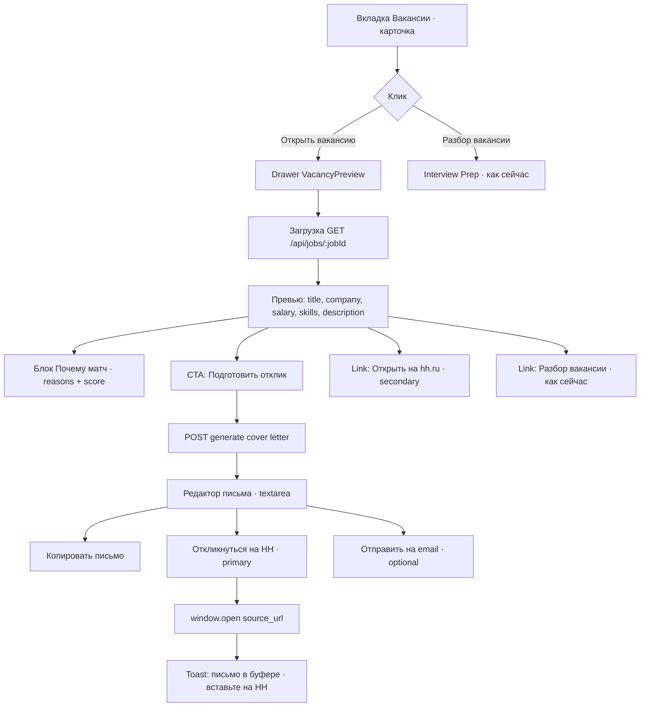
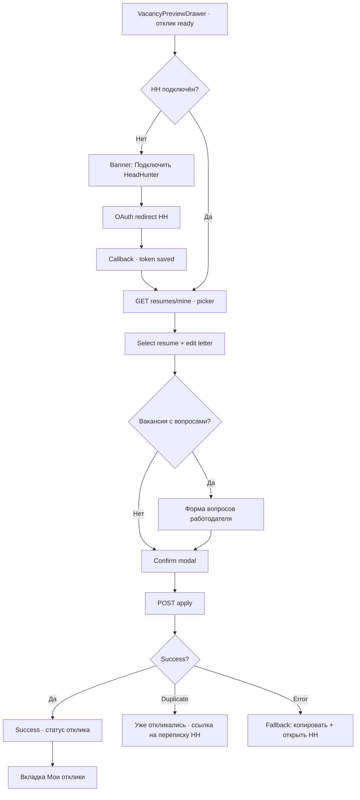

# Vacancy Preview & Apply — UX-flow и API (MVP / V2)

Спецификация для фичи «Открыть вакансию → превью в LEO → сопроводительное → отклик в HH».

**Контекст:** сейчас `MatchedJobCard` ведёт на внешний `source_url` (hh.ru). Данные вакансии уже в БД (`job-matching`), сопроводительное генерируется в Jack без привязки к вакансии, HH OAuth пользователей не подключён.

**Границы сервисов (AGENTS.md):**

| Слой | Сервис | Ответственность |
|------|--------|-----------------|
| UI | `frontend` | Drawer превью, форма письма, OAuth redirect |
| Оркестрация | `conversation` | Генерация отклика (профиль + вакансия), черновики |
| Промпты / LLM | `ai-nlp` | Промпт «tailored cover letter» |
| Вакансии | `job-matching` | CRUD вакансий, refresh с HH, telemetry |
| HH OAuth & apply | `user-profile` (V2) | Токены пользователя, прокси к HH negotiations |
| Email fallback | `email` | Отправка пакета резюме+письмо (уже есть) |

---

## Текущее состояние (baseline)

| Что есть | Где |
|----------|-----|
| Список матчей | `GET /api/jobs/match/:userId` |
| Детали вакансии | `GET /api/jobs/:jobId` |
| Telemetry | `POST /api/jobs/interaction` (`view`, `like`, `dislike`, `apply`) |
| Generic cover letter + email | `POST /api/chat/session/:id/resume-email` |
| Разбор вакансии (Interview Prep) | `handleVacancyPrepFromJob` в `frontend/app/chat/page.tsx` |
| HH scrape (application token) | `job-matching/scraper.ts` |
| HH user token (серверный, salary) | `hhAuthService.ts` — **не per-user** |

**ID вакансии:** `job.id` — внутренний UUID LEO. ID на HH извлекается из `source_url` (`/vacancy/{id}`), см. `vacancyUrl.ts`.

---

## MVP — In-app preview + tailored отклик (без auto-submit в HH)

**Цель:** пользователь не уходит с платформы; получает персонализированное сопроводительное; отклик — вручную на hh.ru с копированием текста.

**Не входит в MVP:** OAuth HH, `POST /negotiations`, синхронизация резюме HH.

---

### MVP — UX-flow



#### Экран 1: список вакансий (изменения минимальные)

| Элемент | Поведение |
|---------|-----------|
| «Открыть вакансию» | Открывает **drawer**, не `<a target=_blank>` |
| «Разбор вакансии» | Без изменений |
| Badge «Новая» | Без изменений |

#### Экран 2: `VacancyPreviewDrawer`

**Header**
- Title, company
- Match score + chip «Рекомендуем» / «Слабое совпадение»
- Meta: источник (hh.ru), дата обновления матча

**Body (scroll)**
- Зарплата, локация, формат работы
- Skills (chips)
- «Почему матч» — `reasons[]` (раскрыт по умолчанию)
- Описание — HTML → plain text (`stripHtmlFromText`)
- Требования — отдельный блок, если есть

**Footer actions**
1. **Подготовить отклик** (primary) — если нет профиля Jack → toast «Сначала заполните профиль в чате»
2. **Открыть на hh.ru** (ghost) — внешняя ссылка
3. **Разбор вакансии** (text) — существующий flow

**Telemetry при открытии drawer:** `POST /api/jobs/interaction` `{ jobId, interactionType: "view" }`.

#### Экран 3: блок «Отклик» (inline в drawer или второй step)

**States**
- `idle` — кнопка «Сгенерировать сопроводительное»
- `generating` — skeleton + «Готовим письмо под вакансию…»
- `ready` — textarea с письмом + bullets (optional, collapsible)
- `error` — retry

**Actions**
| Кнопка | Действие |
|--------|----------|
| Сгенерировать заново | Повторный POST с `regenerate: true` |
| Сделать короче / формальнее | Quick actions → POST с `tone` |
| Копировать | `navigator.clipboard` + toast |
| **Откликнуться на HH** | Copy + open `source_url` + telemetry `apply` |
| Отправить на email | Reuse `resume-email` или новый endpoint с `jobId` |

**Copy для «Откликнуться на HH»:**
> «Открыли вакансию на HeadHunter. Сопроводительное скопировано — вставьте его в поле отклика.»

**Empty / edge cases**
- Нет `description` → skeleton + `GET /api/jobs/:id?refresh=true` (см. API)
- Demo/mock job (`source_url` null) → только превью из карточки, без HH-ссылки
- Вакансия superjob.ru → превью работает; CTA «Откликнуться» → их URL

---

### MVP — API

#### Существующие (без изменений)

```
GET  /api/jobs/match/:userId          # auth: user JWT
GET  /api/jobs/:jobId                 # auth: user JWT
POST /api/jobs/interaction            # body: { jobId, interactionType }
```

#### Новые / расширенные

##### 1. `GET /api/jobs/:jobId` — расширение response

**Query:** `?refresh=1` — опционально подтянуть свежие данные с HH (только `source=hh.ru`).

**Response 200:**
```typescript
interface JobDetailsResponse {
  job: Job;                    // существующая модель
  externalVacancyId: string | null;  // HH id из source_url
  publicUrl: string | null;    // resolvePublicVacancyUrl()
  stale: boolean;              // updated_at старше N дней
}
```

**Реализация:** `job-matching` — при `refresh=1` вызвать `fetchVacancyDetails(hhId)` из scraper, upsert, вернуть.

---

##### 2. `POST /api/jobs/:jobId/application-draft` — генерация отклика

**Сервис:** `conversation` (оркестрация) → `ai-nlp` (промпт).

**Auth:** Bearer JWT (только свой userId).

**Body:**
```typescript
interface ApplicationDraftRequest {
  sessionId?: string;          // Jack session для collectedData; иначе active session
  tone?: 'neutral' | 'formal' | 'concise';
  regenerate?: boolean;
  locale?: 'ru';               // default ru
}
```

**Response 200:**
```typescript
interface ApplicationDraftResponse {
  jobId: string;
  coverLetter: string;         // 5–10 предложений, plain text
  headline?: string;           // одна строка «почему я»
  bullets?: string[];          // 3–5 тезисов под требования
  matchHighlights?: string[];  // из reasons матча, для UI
  generatedAt: string;         // ISO
  promptVersion: string;       // для A/B и отладки
}
```

**Errors:**
- `404` — job not found
- `422` — профиль слишком пустой (`collectedData` без desired_role / опыта)
- `503` — LLM недоступен

**Промпт (ai-nlp):** новый handler `generateApplicationDraft` — вход: `collectedData`, `job { title, company, description, requirements, skills }`, `tone`.

---

##### 3. `POST /api/jobs/:jobId/application-email` — отправка пакета на почту

**Сервис:** `conversation` → `email` (как `resume-email`, но с привязкой к job).

**Body:**
```typescript
interface ApplicationEmailRequest {
  email?: string;              // default: user.email
  coverLetter: string;         // из draft или отредактированное пользователем
  includeResume?: boolean;     // default true
  sessionId?: string;
}
```

**Response 200:** `{ success: true, email: string }`

---

##### 4. Telemetry — расширение (optional MVP+)

Расширить `interactionType`:
```typescript
type JobInteractionType =
  | 'view'           // открыли drawer
  | 'draft_generated'
  | 'apply_intent'   // нажали «Откликнуться на HH»
  | 'apply'          // legacy alias для apply_intent
  | 'like' | 'dislike';
```

---

### MVP — модели данных

#### Shared types (`frontend/types/jobs.ts` — новый файл)

```typescript
export interface JobPublic {
  id: string;
  title: string;
  company: string;
  location: string[];
  salary_min: number | null;
  salary_max: number | null;
  currency: string | null;
  description: string;
  requirements: string;
  skills: string[];
  experience_level: string | null;
  work_mode: string | null;
  source: string;
  source_url: string;
  posted_at: string | null;
  updated_at?: string;
}

export interface ApplicationDraft {
  jobId: string;
  coverLetter: string;
  headline?: string;
  bullets?: string[];
  matchHighlights?: string[];
  generatedAt: string;
}

export type VacancyPreviewStep = 'preview' | 'application';
```

#### DB — без миграций в MVP

Черновики не персистим (session-only / client state). При refresh drawer — повторная генерация.

**Optional (MVP+):** таблица `application_drafts` в `job-matching` или `conversation` — см. V2.

---

### MVP — компоненты frontend

| Компонент | Назначение |
|-----------|------------|
| `VacancyPreviewDrawer.tsx` | Drawer + orchestration |
| `VacancyPreviewContent.tsx` | Описание, skills, reasons |
| `ApplicationDraftPanel.tsx` | Генерация, editor, actions |
| `MatchedJobCard.tsx` | `onOpenVacancy` вместо `<a href>` |

**Hooks:**
- `useJobDetails(jobId, { refresh })`
- `useApplicationDraft(jobId, sessionId)`

---

### MVP — acceptance criteria

- [x] Клик «Открыть вакансию» открывает drawer, не уводит с вкладки
- [x] Описание вакансии видно без перехода на HH
- [x] «Почему матч» видно для recommended и weak
- [x] Сопроводительное генерируется с учётом **конкретной** вакансии и профиля LEO
- [x] «Откликнуться на HH» копирует письмо и открывает hh.ru в новой вкладке
- [x] Telemetry `view` и `apply_intent` пишутся
- [x] Mock/demo jobs не показывают битую HH-ссылку (CTA скрыт без `publicUrl`)
- [ ] Отправка пакета на email (`application-email`, S2.1)

---

## V2 — OAuth HH + отклик из продукта

**Цель:** после confirm пользователя отправить `POST https://api.hh.ru/negotiations` от его имени; показывать статус откликов в LEO.

**Зависимости:** приложение на [dev.hh.ru](https://dev.hh.ru), scopes для резюме и откликов, хранение refresh token per user.

---

### V2 — UX-flow



#### Новые UI-точки

| Экран | Описание |
|-------|----------|
| **Подключить HH** | Профиль → «Интеграции» или banner в drawer |
| **Выбор резюме** | Radio list из `GET /resumes/mine` (title, updated, url preview) |
| **Confirm apply** | «Откликнуться на {title} в {company} резюме «{resumeTitle}»?» + checkbox согласия |
| **Employer questions** | Dynamic form из HH `apply_conditions` |
| **Мои отклики** | Список `negotiations?status=active` — vacancy, state, date |
| **Fallback** | Любая ошибка HH API → MVP-flow (copy + open) |

#### Состояния отклика (mapping HH → UI)

| HH state (упрощённо) | UI label |
|----------------------|----------|
| response | Отправлен |
| invitation | Приглашение |
| discard | Отклонён / закрыт |
| … | См. HH docs |

---

### V2 — API

#### user-profile — HH OAuth

```
GET  /api/users/oauth/hh/start
GET  /api/users/oauth/hh/callback
GET  /api/users/integrations/hh          # status: connected | expired | none
DELETE /api/users/integrations/hh        # revoke
```

**`GET /integrations/hh` response:**
```typescript
interface HhIntegrationStatus {
  connected: boolean;
  hhUserId?: string;
  expiresAt?: string;          // access token expiry (не показывать refresh)
  scopes?: string[];
  resumesCount?: number;
}
```

**DB (user-profile):** таблица `user_oauth_tokens`

```sql
CREATE TABLE user_oauth_tokens (
  id UUID PRIMARY KEY DEFAULT gen_random_uuid(),
  user_id UUID NOT NULL REFERENCES users(id) ON DELETE CASCADE,
  provider VARCHAR(32) NOT NULL,  -- 'hh'
  access_token TEXT NOT NULL,
  refresh_token TEXT,
  expires_at TIMESTAMPTZ,
  provider_user_id VARCHAR(64),
  scopes TEXT[],
  created_at TIMESTAMPTZ DEFAULT NOW(),
  updated_at TIMESTAMPTZ DEFAULT NOW(),
  UNIQUE(user_id, provider)
);
```

---

#### job-matching (или отдельный `application` service) — HH proxy

Рекомендация: **`job-matching/hhApplyService.ts`** для co-location с HH client; auth token пользователя передаётся через `user-profile` internal call или proxy с user JWT.

```
GET  /api/jobs/hh/resumes
GET  /api/jobs/hh/resumes/:resumeId
GET  /api/jobs/:jobId/hh/apply-conditions
POST /api/jobs/:jobId/hh/apply
GET  /api/jobs/hh/negotiations
GET  /api/jobs/hh/negotiations/:negotiationId
```

##### `GET /api/jobs/hh/resumes`

Прокси `GET https://api.hh.ru/resumes/mine`.

```typescript
interface HhResumeSummary {
  id: string;                  // resume_id для apply
  title: string;
  updatedAt: string;
  status: string;
  url: string;
}
```

##### `GET /api/jobs/:jobId/hh/apply-conditions`

Прокси метода apply-to-vacancy pre-check (вакансия, обязательность письма, вопросы).

```typescript
interface HhApplyConditions {
  vacancyId: string;
  coverLetterRequired: boolean;
  hasQuestions: boolean;
  questions?: HhEmployerQuestion[];
  alreadyApplied: boolean;
  negotiationId?: string;      // если уже откликались
}

interface HhEmployerQuestion {
  id: string;
  text: string;
  required: boolean;
  type: 'text' | 'choice';
  choices?: string[];
}
```

##### `POST /api/jobs/:jobId/hh/apply`

**Body:**
```typescript
interface HhApplyRequest {
  resumeId: string;
  message: string;             // cover letter
  questionAnswers?: Record<string, string>;
  confirmed: true;               // explicit user consent
}
```

**Response 201:**
```typescript
interface HhApplyResponse {
  negotiationId: string;
  state: string;
  vacancyUrl: string;
  appliedAt: string;
}
```

**Errors (mapped):**
| Code | HH / case | UX |
|------|-----------|-----|
| `409` | already applied | показать existing negotiation |
| `422` | missing required letter / answers | вернуть validation |
| `401` | token expired | «Переподключите HH» |
| `403` | resume not published | «Опубликуйте резюме на HH» |

**Upstream:** `POST https://api.hh.ru/negotiations` с user access token.

##### `GET /api/jobs/hh/negotiations`

Query: `?status=active&page=0&per_page=20`

```typescript
interface HhNegotiationListResponse {
  items: HhNegotiationItem[];
  page: number;
  pages: number;
  total: number;
}

interface HhNegotiationItem {
  id: string;
  vacancy: { id: string; name: string; employer: { name: string } };
  resume: { id: string; title: string };
  state: string;
  updatedAt: string;
  messagesUrl?: string;
}
```

---

#### conversation — сохранение черновиков (V2)

```
GET    /api/applications/drafts?jobId=
POST   /api/applications/drafts
PATCH  /api/applications/drafts/:draftId
POST   /api/applications/drafts/:draftId/submit-hh   # → job-matching apply
```

**DB:**
```sql
CREATE TABLE application_drafts (
  id UUID PRIMARY KEY DEFAULT gen_random_uuid(),
  user_id UUID NOT NULL,
  job_id UUID NOT NULL REFERENCES jobs(id),
  cover_letter TEXT NOT NULL,
  headline TEXT,
  bullets JSONB,
  tone VARCHAR(16),
  status VARCHAR(16) DEFAULT 'draft',  -- draft | submitted | failed
  hh_negotiation_id VARCHAR(64),
  submitted_at TIMESTAMPTZ,
  created_at TIMESTAMPTZ DEFAULT NOW(),
  updated_at TIMESTAMPTZ DEFAULT NOW(),
  UNIQUE(user_id, job_id)
);
```

---

### V2 — модели (shared)

```typescript
// packages/shared или frontend/types/hh.ts

export interface HhIntegrationStatus { /* см. выше */ }
export interface HhResumeSummary { /* см. выше */ }
export interface HhApplyConditions { /* см. выше */ }
export interface HhApplyRequest { /* см. выше */ }
export interface HhApplyResponse { /* см. выше */ }

export interface ApplicationDraftRecord extends ApplicationDraft {
  id: string;
  userId: string;
  status: 'draft' | 'submitted' | 'failed';
  hhNegotiationId?: string;
}
```

---

### V2 — env / конфиг

```bash
# user-profile
HH_OAUTH_CLIENT_ID=
HH_OAUTH_CLIENT_SECRET=
HH_OAUTH_REDIRECT_URI=          # .../api/users/oauth/hh/callback
HH_OAUTH_SCOPES=                # resumes, negotiations — по доке dev.hh.ru

# job-matching (уже есть)
HH_API_URL=https://api.hh.ru
HH_USER_AGENT=leoAI/1.0 (email)
```

---

### V2 — acceptance criteria

- [ ] Пользователь подключает HH один раз; token refresh автоматический
- [ ] Видит список своих резюме на HH и выбирает для отклика
- [ ] Отклик с сопроводительным уходит через API без ручного copy-paste
- [ ] Обрабатываются: duplicate apply, required questions, expired token
- [ ] «Мои отклики» показывает активные переговоры
- [ ] При ошибке HH — graceful fallback на MVP-flow
- [ ] В terms/UI явный confirm: «LEO отправит отклик от вашего имени на HeadHunter»

---

## План реализации по спринтам

| Спринт | Scope | Сервисы |
|--------|-------|---------|
| S1 | Drawer + расширенный `GET /jobs/:id` | frontend, job-matching | ✅ |
| S2 | `application-draft` + промпт ai-nlp | conversation, ai-nlp | ✅ |
| S2.1 | `application-email` | conversation, email | ⏳ |
| S3 | Copy+open HH, telemetry | frontend, job-matching | ✅ |
| S4 | HH OAuth user-profile | user-profile, frontend | ✅ см. ниже |
| S5 | resumes + apply-conditions + apply | job-matching |
| S6 | Negotiations list + drafts DB | job-matching, conversation |

---

## Связанные документы

- [CASE_STUDY_IVAN_REPORT.md](./CASE_STUDY_IVAN_REPORT.md) — gap «Нет Откликнуться»
- [ARCHITECTURE.md](./ARCHITECTURE.md) — границы сервисов
- [HH negotiations API](https://github.com/hhru/api/blob/master/docs/negotiations.md)
- [VACANCY_APPLY_V2_PLAN.md](./VACANCY_APPLY_V2_PLAN.md) — OAuth dev.hh.ru, спринты S4–S6
- [CONFIGURATION.md](./HISTORY/CONFIGURATION.md) — HH env vars

---

## Открытые вопросы (решить до V2)

1. **Где жить apply-proxy:** `job-matching` vs resurrect `services/application`?
2. **Резюме LEO → HH:** синхронизировать PDF или только выбор существующего HH resume?
3. **SuperJob apply:** отдельный V2.1 или только HH?
4. **Rate limits HH:** очередь / retry policy для apply
5. **Юридический текст:** обновление Terms + consent checkbox
