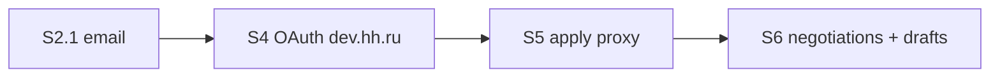

# Vacancy Apply V2 — план (HH OAuth + отклик из LEO)

Дополнение к [`VACANCY_APPLY_FLOW.md`](./VACANCY_APPLY_FLOW.md). MVP (S1–S3) закрыт, кроме **S2.1 email**. V2 — отклик через HH API от имени пользователя.

**Цель V2:** после confirm пользователь отправляет отклик без copy-paste; LEO показывает статус переговоров.

---

## Предпосылки (решить до старта S4)

| # | Вопрос | Рекомендация |
|---|--------|--------------|
| 1 | Где apply-proxy? | `job-matching` (`hhApplyService.ts`) — рядом с scraper и HH client |
| 2 | Резюме LEO → HH? | **V2:** только выбор существующего HH resume (`GET /resumes/mine`). PDF/sync — отдельный эпик |
| 3 | SuperJob apply? | **V2.1** или never — фокус на HH |
| 4 | Rate limits | Очередь + retry 429/503; один apply in-flight per user |
| 5 | Юридическое | Checkbox «LEO отправит отклик от вашего имени на HeadHunter» + обновление Terms |

---

## Регистрация приложения на dev.hh.ru

1. Войти на [dev.hh.ru](https://dev.hh.ru) под аккаунтом работодателя/разработчика LEO.
2. **Мои приложения → Создать приложение.**
3. Заполнить:
   - Название: `LEO AI` (как в `HH_USER_AGENT`)
   - Redirect URI (OAuth):  
     `https://leo-ai.ru/api/users/oauth/hh/callback` (prod)  
     `http://localhost:3001/api/users/oauth/hh/callback` (local)
   - User-Agent / контакт: email из `HH_USER_AGENT` (см. CONFIGURATION.md)
4. Получить:
   - **Client ID** (`HH_OAUTH_CLIENT_ID`)
   - **Client Secret** (`HH_OAUTH_CLIENT_SECRET`)
   - **Application token** (`HH_API_KEY`, APPL…) — уже используется для scrape/search
5. Запросить scopes для **user OAuth** (по актуальной доке HH):
   - доступ к резюме соискателя
   - отклики / переговоры (`negotiations`)
   - профиль пользователя (для привязки `provider_user_id`)

> Точный список scope сверить с [HH API OAuth](https://github.com/hhru/api/blob/master/docs/authorization_for_user.md) на момент реализации.

---

## Env-переменные (новые)

```bash
# user-profile — per-user OAuth
HH_OAUTH_CLIENT_ID=
HH_OAUTH_CLIENT_SECRET=
HH_OAUTH_REDIRECT_URI=          # = callback URL в dev.hh.ru
HH_OAUTH_SCOPES=                # через пробел, см. доку HH

# уже есть в job-matching
HH_API_URL=https://api.hh.ru
HH_USER_AGENT=leoAI/1.0 (support@...)
HH_API_KEY=                     # application token (scrape)
```

Миграция БД (`user-profile`):

```sql
CREATE TABLE user_oauth_tokens (
  id UUID PRIMARY KEY DEFAULT gen_random_uuid(),
  user_id UUID NOT NULL REFERENCES users(id) ON DELETE CASCADE,
  provider VARCHAR(32) NOT NULL DEFAULT 'hh',
  access_token TEXT NOT NULL,
  refresh_token TEXT,
  expires_at TIMESTAMPTZ,
  provider_user_id VARCHAR(64),
  scopes TEXT[],
  created_at TIMESTAMPTZ DEFAULT NOW(),
  updated_at TIMESTAMPTZ DEFAULT NOW(),
  UNIQUE(user_id, provider)
);
```

---

## Спринты V2

### S4 — HH OAuth (`user-profile` + frontend)

**Backend**
- Расширить `OAuthProvider`: `'hh'` в `oauthService.ts` (по аналогии с Yandex).
- Routes (из спеки):
  - `GET /api/users/oauth/hh/start`
  - `GET /api/users/oauth/hh/callback`
  - `GET /api/users/integrations/hh` — status
  - `DELETE /api/users/integrations/hh` — revoke
- Сохранение токенов в `user_oauth_tokens`, auto-refresh перед истечением.
- Internal API или shared lib: `getHhUserToken(userId)` для job-matching.

**Frontend**
- Banner в `VacancyPreviewDrawer` / профиль → «Подключить HeadHunter».
- Redirect flow + success/error на `/oauth/callback` (расширить существующий handler).

**DoD S4**
- [x] Пользователь подключает HH один раз
- [x] Token refresh работает без re-login (`getValidAccessToken` + refresh_token)
- [x] `GET /integrations/hh` → `{ connected: true, resumesCount? }`

---

### S5 — Apply API (`job-matching`)

**Новые endpoints**
```
GET  /api/jobs/hh/resumes
GET  /api/jobs/:jobId/hh/apply-conditions
POST /api/jobs/:jobId/hh/apply
```

**`hhApplyService.ts`**
- Прокси с **user** access token (не application token).
- `POST https://api.hh.ru/negotiations` — cover letter + resume_id.
- Маппинг ошибок: 409 duplicate, 422 validation, 401 expired → «Переподключите HH».

**Frontend (`ApplicationDraftPanel`)**
- Если HH connected: primary CTA «Откликнуться через LEO» вместо copy+open.
- Modal: выбор резюме (radio) + confirm checkbox.
- Fallback на MVP-flow при любой ошибке HH.

**DoD S5**
- [ ] Список резюме с HH
- [ ] Apply с сопроводительным из textarea
- [ ] Duplicate apply → понятное сообщение
- [ ] Expired token → redirect на reconnect

---

### S6 — «Мои отклики» + drafts DB (`conversation` + frontend)

**DB** `application_drafts` (см. спеку).

**API**
```
GET    /api/applications/drafts?jobId=
POST   /api/applications/drafts
PATCH  /api/applications/drafts/:draftId
POST   /api/applications/drafts/:draftId/submit-hh
GET    /api/jobs/hh/negotiations
```

**UI**
- Вкладка или секция «Мои отклики» — список negotiations.
- Черновик сохраняется при закрытии drawer (не теряется).

**DoD S6**
- [ ] Draft persist per user+job
- [ ] Список активных откликов
- [ ] Graceful fallback на copy+open

---

## Порядок работ (рекомендуемый)



1. **S2.1** — закрыть MVP (`application-email`).
2. **S4** — dev.hh.ru app + OAuth (можно тестировать на sandbox user).
3. **S5** — apply end-to-end на staging.
4. **S6** — UX retention (отклики, черновики).

---

## Локальная проверка OAuth

1. Зарегистрировать redirect `http://localhost:3001/api/users/oauth/hh/callback`.
2. `npm run dev:up`, залогиниться в LEO.
3. «Подключить HH» → авторизация на hh.ru → callback → token в Postgres.
4. `curl` с JWT: `GET /api/users/integrations/hh`.
5. `GET /api/jobs/hh/resumes` — должен вернуть резюме тестового аккаунта.

---

## Риски

| Риск | Митигация |
|------|-----------|
| HH меняет scopes / apply API | Версионировать client; мониторить [hhru/api](https://github.com/hhru/api) |
| Пользователь без опубликованного резюме | 403 → «Опубликуйте резюме на HH» |
| Вакансия с обязательными вопросами | Dynamic form из `apply-conditions` (S5.1) |
| OAuth на prod vs local redirect | Два приложения на dev.hh.ru или два redirect URI в одном app |

---

## Связанные файлы (baseline)

| Область | Файл |
|---------|------|
| OAuth pattern | `services/user-profile/src/services/oauthService.ts` |
| HH server token | `services/job-matching/src/services/hhAuthService.ts` |
| Apply UI | `frontend/components/chat/ApplicationDraftPanel.tsx` |
| Спека MVP/V2 | `docs/VACANCY_APPLY_FLOW.md` |
